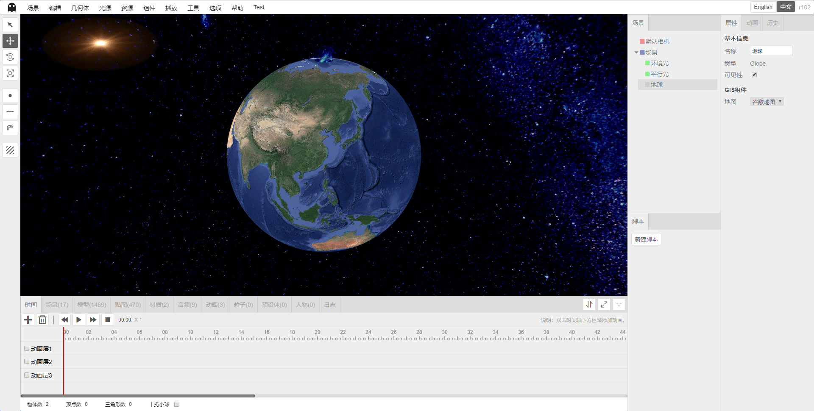

# Shadow Editor

Language: [中文](README.md) / [繁體中文](README-tw.md) / English / [日本語](README-jp.md) / [Le français](README-fr.md) / [русский](README-ru.md)

* Name: Shadow Editor
* Version: v0.1.7
* Introduction: Scene editor based on `three.js`.

## v0.1.7 updated

1. After the object is repaired, the scene tree cannot respond in time, and the bug that the tree node is expanded and the tree nodes are out of order cannot be remembered.
2. After the object name exceeds 8 characters, the scene tree will display an ellipsis. Move the mouse over the node to display the full name.
3. Added full-screen playback and new window playback. The player and editor are completely decoupled and the player can run independently.
4. The edited scene can be embedded in the iframe to run. Address: `/view.html?sceneID=sceneID`. This address can be obtained using the new window playback function.
5. Object selection effect optimization: equal width stroke.
6. Fix the build model tool and copy the model without copying all the files in the folder.
7. All settings are stored in `localStorage` instead and are no longer saved in the scene configuration.
8. Reconstructed parallel light helper, hemispherical light helper, point light helper, rectangular light helper, spotlight helper, event-driven, no longer heavily dependent on the editor.
9. Organize the folder structure. Rewrite the history panel module to completely remove the highly coupled Outliner control.
10. English translation optimization.
11. Add a scene one-click export function to automatically analyze the models and resources needed for the scene. All required resources are placed in the `/temp/yyyyMMddHHmmss` folder.
12. Export the editor function without resources.
13. Re-released the demo project: [Gitee](http://tengge1.gitee.io/shadoweditor-examples/) [GitHub](https://tengge1.github.io/ShadowEditor-examples/)
14. Fix the renderer settings, shadow, γ input, γ output, gamma factor setting invalid bug.
15. Only one point can be drawn at a time for points, lines and spray tools on the plane.

## Project screenshot

Warm little nest.



[Click here](images/README.md) for more screenshots.

<table>
    <tr>
        <td>Source</td>
        <td><a href="https://github.com/tengge1/ShadowEditor">GitHub</a></td>
        <td><a href="https://gitee.com/tengge1/ShadowEditor">Code Cloud</a></td>
        <td>Document</td>
        <td><a href="https://tengge1.github.io/ShadowEditor/">GitHub</a></td>
        <td><a href="https://tengge1.gitee.io/shadoweditor/">Code Cloud</a></td>
    </tr>
    <tr>
        <td>Demo</td>
        <td><a href="https://tengge1.github.io/ShadowEditor-examples/">GitHub</a></td>
        <td><a href="http://tengge1.gitee.io/shadoweditor-examples/">Code Cloud</a></td>
        <td>Databases and Resources</td>
        <td><a href="https://pan.baidu.com/s/1VfgewDdoNP_N9VQQ4iUCeg" target="_blank">Baidu Network Disk 20190116</a></td>
        <td>Extraction code: n8je</td>
    </tr>
</table>

## The main function

1. Based on the three-dimensional scene online editor of three.js/WebGL, the server uses `MongoDB` to save animation, audio, category, character, texture, material, mesh model, particle, preset body, scene data.
2. Built-in geometry: plane, cube, circle, cylinder, sphere, icosahedron, tire, knot, teapot, wine glass, elf, text; line segment, CatmullRom curve, quadratic Bezier curve, cubic Bezier curve , elliptic curve.
3. Built-in light source: ambient light, parallel light, point light source, spotlight, hemispherical light, rectangular light. The point source increases the illuminant and halo effects; the hemisphere light increases the sky effect; the rectangular light increases the illuminant effect.
4. Support a variety of different 3D format models and animation imports. Support `3ds`, `3mf`, `amf`, `assimp`(anim), `awd`, `babylon`, `binary`, `bvh`(anim), `collada`, `ctm`, `draco` , `fbx`(anim), `gcode`, `gltf`(anim), `js`(anim), `json`(anim), `kmz`, `lmesh`(anim), `md2`, `mmd `(anim), `nrrd`, `obj`, `pcd`, `pdb`, `ply`, `prwm`, `sea3d`(anim), `stl`, `vrm`, `vrml`, `vtk `, `x` 31 kinds of 3D file format, with the support of `anim` to support animation. A variety of 3D files support both `json` and binary formats. The `mmd` file supports both `pmd` and `pmx` formats, supporting models and camera animations in the `vmd` format. It is also the only editor that supports `lmesh` (lolking website lol model).
5. Built-in materials: line material, dashed material, basic material, depth material, normal vector material, Lambert material, Fung material, point cloud material, standard material, physical material, sprite material, shader material, raw shader Material.
6. Support textures: color texture, transparent texture, bump texture, normal texture, displacement texture, mirror texture, environment texture, lighting texture, occlusion texture, self-illumination texture.
7. Support texture: picture, cube texture, video texture.
8. Built-in components: background music, particle emitters, sky, flame, water, smoke, cloth, rigid body components.
9. Visually modify the properties of objects such as scenes and cameras, and provide more than 40 different modification panels.
10. Edit js scripts, shader programs online, with smart tips.
11. Bring your own player to demonstrate the dynamic effects of the scene in real time and play the audio.
12. Support tween animation, skeletal animation, particle animation, mmd animation, lmesh animation (lolking website lol model).
13. Support scenes, models, textures, materials, audio, animation, particles, presets, character resource management, support custom classification, and quickly search according to Chinese characters and pinyin. Among them, the particle, preset body, and role resource management have not yet achieved the corresponding functions.
14. Supports five kinds of controllers: first view controller, flight controller, track controller, pointer lock controller and trackball controller.
15. Supports dot matrix effects, color shift effects, afterimage effects, background blur, fast approximation anti-aliasing (FXAA), glitch effects, halftone effects, full-screen anti-aliasing (SSAA), pixel effects, scalable ambient light Occlusion (SAO), Multi-Sampling Anti-Aliasing (SMAA), Screen Space Ambient Occlusion (SSAO), Time Anti-Aliasing (TAA).
16. Provide history and log functions to support undo and redo.
17. Support for exporting `gltf`, `obj`, `ply`, `stl` models.
18. Support for the `bullet` physics engine. Rigid body components are supported by cubes, circles, cylinders, icosahedrons, wine glasses, planes, spheres, teapots, tires, knots, and loaded models. Support visualization to set the shape of the collision body (square, sphere), mass and inertia.
19. With pan, rotate, zoom, draw points, lines, decals on the surface of the object, real-time statistics of the number of objects, vertices, triangles.

## user's guidance

**This project only supports Windows system, you need to install .Net Framework 4.5 on your computer.**

**Recommended to use the latest version of Google Chrome, is not guaranteed to be compatible with other browsers.**

1. Install `NodeJs`. In the current directory, execute the following command.

```bash
Npm install
Npm run build
```

2. Download `MongoDB` to install and start the MongoDB service. The default port for the MongoDB service is 27017.

```bash
Mongod --dbpath=D:\mongodb\db --logpath=D:\mongodb\log\mongoDB.log --install --serviceName MongoDB
Net start MongoDB
```

3. Edit the file `ShadowEditor.Web/Web.config` and change `27017` to the port of the MongoDB service on your computer.

```xml
<add key="mongo_connection" value="mongodb://127.0.0.1:27017" />
```

4. Open the project with `Visual Studio 2017` and generate the `ShadowEditor.Web` project.

5. Deploy `ShadowEditor.Web` on iis to access it in the browser.

6. In order to save various types of files for normal download, you need to add the following two MIME types on iis.

| File Extension | MIME Type | Description |
| --------- | -------- | ---- |
| .* | application/octet-stream | Various Format Suffix Files |
| . | application/octet-stream | No suffix files |

7. Compile the documentation, please install gitbook.

```bash
Npm install -g gitbook-cli
```

Then switch to the `docs-dev` directory and install the gitbook plugin.

```bash
Gitbook install
```

Then switch to the parent directory and execute the following command to generate the document.

```bash
Npm run build-docs
```

## common problem

1. The function of publishing static websites cannot be used.

Shadow Editor requires server support. Please follow the [User Guide] (#User Guide) to configure the relevant environment.

2. Why is the upload failed when uploading the model?

Resources such as model maps need to be compressed into a zip package, and the import file cannot be nested in folders. The server will extract the uploaded zip package into the `~/Upload/Model` file and add a piece of data to the MongoDB `_Mesh` table.

3. How to combine multiple models together?

Basic geometry supports multiple levels of nesting. You can add a `group` (in the geometry menu) and drag multiple models onto the 'group' on the scene tree.

## Update log

**v0.1.7**

1. After the object is repaired, the scene tree cannot respond in time, and the bug that the tree node is expanded and the tree nodes are out of order cannot be remembered.
2. After the object name exceeds 8 characters, the scene tree will display an ellipsis. Move the mouse over the node to display the full name.
3. Added full-screen playback and new window playback. The player and editor are completely decoupled and the player can run independently.
4. The edited scene can be embedded in the iframe to run. Address: `/view.html?sceneID=sceneID`. This address can be obtained using the new window playback function.
5. Object selection effect optimization: equal width stroke.
6. Fix the build model tool and copy the model without copying all the files in the folder.
7. All settings are stored in `localStorage` instead and are no longer saved in the scene configuration.
8. Reconstructed parallel light helper, hemispherical light helper, point light helper, rectangular light helper, spotlight helper, event-driven, no longer heavily dependent on the editor.
9. Organize the folder structure. Rewrite the history panel module to completely remove the highly coupled Outliner control.
10. English translation optimization.
11. Add a scene one-click export function to automatically analyze the models and resources needed for the scene. All required resources are placed in the `/temp/yyyyMMddHHmmss` folder.
12. Export the editor function without resources.
13. Re-released the demo project: [Gitee](http://tengge1.gitee.io/shadoweditor-examples/) [GitHub](https://tengge1.github.io/ShadowEditor-examples/)
14. Fix the renderer settings, shadow, γ input, γ output, gamma factor setting invalid bug.
15. Only one point can be drawn at a time for points, lines and spray tools on the plane.

**v0.1.6**

* Release date: March 10, 2019
* Update log:

1. Use `xtype.js` to refactor the UI framework in a non-intrusive way.
2. The main frame is repositioned using absolute positioning.
3. The bottom panel supports maximization and restoration.
4. The bottom panel displays resource statistics.
5. Collect and sort out a large number of textures and models.
6. Organize the mapping tool.
7. Organize the model tools.
8. Organize the thumbnail tool.
9. Add a point source and no longer add spheres and halos by default.
10. Add the hemisphere light and no longer add the sky ball by default.
11. Add a rectangular light and no longer add a rectangular white screen by default.
12. Since the original selection effect was achieved using `post-processing', severe performance loss and aliasing occurred. So use the `normal extrusion> and `template test` methods to re-implement the selected effect.
13. The selected effect after rewriting is no longer jagged, and the fast anti-aliasing (FXAA) function is not enabled by default, which improves performance. For old scenes, uncheck `Quick Approximate Anti-Aliasing (FXAA)` in the scene properties and save again.
14. By default, no `postprocessing> related shaders and special effects libraries are loaded to improve loading speed.
15. Fix the creation script comment not finished bug.
16. Fold the bottom panel feature.
17. Rewrite the scene tree control to support folding, dragging, and selection.
18. When you click on the scene to select the model, the scene tree prioritizes the entire model, not part of the model, and automatically expands and scrolls to the selected model.

**v0.1.5**

* Release date: February 23, 2019
* Update log:

1. Line segment, CatmullRom curve, quadratic Bezier curve, cubic Bezier curve, elliptic curve visual editing, saving and loading.
2. Fix bugs where the animation on the timeline cannot be dragged.
3. Fix a bug where you can't drag an object onto a group in the scene tree view.
4. Basic geometry supports multi-level nesting, which can save the load normally.
5. Fix the perspective control size calculation bug.
6. Fix bugs where the view control may be obscured by other objects.

**v0.1.4**

* Release date: February 11, 2019
* Update log:

1. Add a control that indicates the direction.
2. Add line segments, CatmullRom curves, quadratic Bezier curves, cubic Bezier curves, elliptic curves. (Not supported for saving)

**v0.1.3**

* Release date: January 28, 2019
* Update log:

1. Multi-language support: Support Chinese and English, support dynamic language switching.
2. Add curve geometry.

**v0.1.2**

* Release date: January 11, 2019
* Update log:

1. Added version control to the scene. The scene table only saves the latest scene, and the historical data is saved in the `scene name_history` table.
2. Save the material to automatically generate a shader thumbnail.
3. Save the modified material loaded into the server model.
4. Rectangle, circular, cylindrical, icosahedron, wine glass, plane, sphere, teapot, tire, knot, and loading model all support rigid body components. Support visualization to set the shape of the collision body (square, sphere), mass and inertia.
5. Add a cube and sphere physical shape helper.

**v0.1.1**

* Release date: December 30, 2018
* Update log:

1. Fix mmd animation and audio out of sync issues. Support multiple mmd models to synchronize with model animation and camera animation.
2. Added dot matrix effects, color shift effects, afterimage effects, background blur, fast approximation anti-aliasing (FXAA), glitch effects, halftone effects, full-screen anti-aliasing (SSAA), pixel effects, scalable environment Light occlusion (SAO), multi-sample anti-aliasing (SMAA), screen space ambient light shading (SSAO), time anti-aliasing (TAA).
3. Add particles, presets, and role panels. (not yet implemented specific functions)

**v0.1.0**

* Release date: December 15, 2018
* Update log:

1. Reorganize the model import function. Currently supports `3ds`, `3mf`, `amf`, `assimp`(anim), `awd`, `babylon`, `bvh`(anim), `collada`, `ctm`, `draco`, `fbx `(anim), `gcode`, `gltf`(anim), `js`(anim), `json`(anim), `kmz`, `lmesh`(anim), `md2`, `mmd`(anim ), `nrrd`, `obj`, `pcd`, `pdb`, `ply`, `prwm`, `sea3d`(anim), `stl`, `vrm`, `vrml`, `vtk`, `` X` 31 kinds of 3D file formats with an expression of `anim` support animation. A variety of 3D files support both `json` and binary formats. The `mmd` file supports both `pmd` and `pmx` formats, supporting models and camera animations in the `vmd` format. It is also the only editor that supports `lmesh` (lolking website lol model).
2. The player adds the first controller, the flight controller, the track controller, the pointer controller, and the five controllers in the camera panel.
3. Scene panel, edit the scene classification, and filter in real time according to category, name, full spell, and pinyin initials.
4. Model panel, edit model classification, filter in real time according to category, name, full spell, and pinyin initials.
5. Map panel, edit the map classification, and filter in real time according to category, name, full spell, and pinyin initials.
6. Material panel, edit material classification, filter in real time according to category, name, full spell, pinyin initials.
7. Audio panel, edit audio classification, filter in real time according to category, name, full spell, pinyin initials.
8. Material component, add a new material and select a material function from the material panel.
9. Textures, Transparent Textures, Bump Textures, Normal Textures, Replacement Textures, Rough Textures, Metal Textures, Environment Textures, Lighting Textures, Occlusion Textures, Glow Textures Select textures from the Map panel.
10. Delete the previous version scene window, model window, texture window, audio window.

**v0.0.9**

* Release date: November 25, 2018
* Update log:

1. Add a cloth with an animation.
2. The gltf model is imported with animation.
3. Skinned morph (*.js) model import with animation. (The model has been removed from the new three.js example.)
4. Flat drawing tools.
5. Flat line drawing tool.
6. Plane decal tool.
7. Check the object effect optimization.

**v0.0.8**

* Release date: October 27, 2018
* Update log:

1. Editor documentation update.
2. The stereo map upload server and can be set as the scene background.
3. All scenarios publish a static website with one click, which is easy to deploy to the `GitHub Pages` service.
4. Berlin terrain components, serialization and deserialization, and can be displayed in the player.
5. Upload the mp4 video texture and set it to the material to play the video in the 3D scene.
6. Add water components.

**v0.0.7**

* Release date: October 14, 2018
* Update log:

1. Scene, model, texture, audio, mmd resource editing function, upload preview.
2. Material texture attribute editing function.
3. The player is re-architected.
4. Particle emitter, sky, flame, smoke save, load, play optimization.
5. The rigid body component is no longer added by default and is manually added from the component menu instead.

**v0.0.6**

* Release date: September 30, 2018
* Update log:

1. Provide tweened animation support. You can visually modify the tweened animation on the timeline and play it in the player.
2. Added upload mmd model (pmd and pmx format) and mmd animation, which can be played in the player.
3. Added upload lmesh model to play in the player.
4. Basic geometry, light source, and terrain package for further development.

**v0.0.5**

* Release date: September 16, 2018
* Update log:

1. Layout modification: The right side is changed to two columns. The left side column provides scene level diagram and js script management function, and the right side column is attribute, setting and history panel.
Add an animation edit (not completed) below the edit scene and move the log view here.
2. Property panel component transformation, adding basic information, camera, geometry, light source, material, particle emitter, physical configuration, scene, shadow,
Multiple components such as displacement, audio monitor, background music, etc.
3. Background music supports save loading and provides audio management.
4. Fix the edit shader program function to see the shader effect in real time.
5. Add a teapot parameter editing component.
6. Various geometries can turn on reflections.

**v0.0.4**

* Release date: September 2, 2018
* Update log:

1. Script editing optimization, the script is no longer bound to the object, can be saved and loaded with the scene, providing javascript, vertexShader, fragmentShader, programInfo sample script. Custom scripts support `init`, `start`, `update`, `stop`, `onClick`, `onDblClick`, `onKeyDown`, `onKeyUp`, `onMouseDown`, `onMouseMove`,
`onMouseUp`, `onMouseWheel`, `onResize` 13 events.

2. The background supports three different types of solid color, background image, and stereo texture, which can be saved and loaded.

3. Added display and hide settings for 9 kinds of helpers for grid, camera, point light, parallel light, spotlight, hemisphere light, rectangular light, helper, and bone.

4. Add a log panel.

5. The mirror adds special mirror effects.

**v0.0.3**

* Release date: August 15, 2018
* Update log:

1. Use `asp.net` to develop the `web` server and use `MongoDB` to save the model and scene data.
2. Upload of 15 formats 3D models and save them to the scene.
3. Create, save, and load scenes.
4. Group, 12 built-in geometries, 5 kinds of light sources can save the scene and load.
5. Serialization and deserialization of 85 three.js objects.

**v0.0.2**

* Release time: June 9, 2018
* Update log:

1. Use `rollup` to refactor the code for the `three.js` built-in editor.

**v0.0.1**

* Release time: June 21, 2017
* Update log:

1. Mainly complete the translation of the three.js built-in editor.

## Related Links

* Three.js official website: https://threejs.org/
* LOL Model Viewer: https://github.com/tengge1/lol-model-viewer