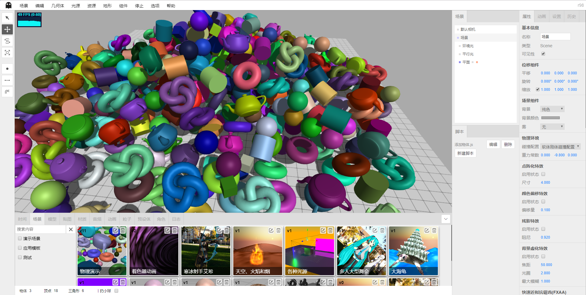

# Shadow Editor

Language: [中文](README.md) / English

* Name: Shadow Editor
* Version: v0.1.3 (In development)
* Description: Scene editor based on `three.js`.

<table>
    <tr>
        <td>Source</td>
        <td><a href="https://github.com/tengge1/ShadowEditor">GitHub</a></td>
        <td><a href="https://gitee.com/tengge1/ShadowEditor">Gitee</a></td>
        <td>Document</td>
        <td><a href="https://tengge1.github.io/ShadowEditor/">GitHub</a></td>
        <td><a href="https://tengge1.gitee.io/shadoweditor/">Gitee</a></td>
    </tr>
    <tr>
        <td>Demo</td>
        <td><a href="https://tengge1.github.io/ShadowEditor-examples/">GitHub</a></td>
        <td><a href="https://tengge1.gitee.io/shadoweditor/">Gitee</a></td>
        <td></td>
        <td></td>
        <td></td>
    </tr>
</table>

## v0.1.2 Update Log

1. Added version control for the scene. The scene table only saves the latest scene, and the historical data is saved in the 'scene name_history` table.
2. Save material automatically generates a shader thumbnail.
3. Save the modified material loaded into the server model.
4. Rigid body components are supported by cubes, circles, cylinders, icosahedrons, wine glasses, planes, spheres, teapots, tires, kinks, and loading models. Support visualization to set the shape of the collision body (square, sphere), mass and inertia.
5. Added cube and sphere physical shape helpers.

## Main Function

1. Based on the three-dimensional scene online editor of three.js/WebGL, the server uses `MongoDB` to save animation, audio, category, character, texture, material, mesh model, particle, preset body, scene data.
2. Built-in geometry: planes, cubes, circles, cylinders, spheres, icosahedrons, tires, knots, teapots, wine glasses, elves, text.
3. Built-in light source: ambient light, parallel light, point light source, spotlight, hemispherical light, rectangular light. The point source increases the illuminant and halo effects; the hemisphere light increases the sky effect; the rectangular light increases the illuminant effect.
4. Support for a variety of different 3D format models and animation imports. Support `3ds`, `3mf`, `amf`, `assimp`(anim), `awd`, `babylon`, `binary`, `bvh`(anim), `collada`, `ctm`, `draco` , `fbx`(anim), `gcode`, `gltf`(anim), `js`(anim), `json`(anim), `kmz`, `lmesh`(anim), `md2`, `mmd `(anim), `nrrd`, `obj`, `pcd`, `pdb`, `ply`, `prwm`, `sea3d`(anim), `stl`, `vrm`, `vrml`, `vtk `, `x` 31 kinds of 3D file format, with the support of `anim` to support animation. A variety of 3D files support both `json` and binary formats. The `mmd` file supports both `pmd` and `pmx` formats, supporting models and camera animations in the `vmd` format. It is also the only editor that supports `lmesh` (lolking website lol model).
5. Built-in materials: line material, dashed material, basic material, depth material, normal vector material, Lambert material, Fung material, point cloud material, standard material, physical material, sprite material, shader material, raw shader material.
6. Support textures: color textures, transparent textures, bump textures, normal textures, displacement textures, mirror textures, ambient textures, lighting textures, occlusion textures, self-illuminating textures.
7. Support textures: images, cube textures, video textures.
8. Built-in components: background music, particle emitters, sky, flame, water, smoke, cloth, rigid body components.
9. Visually modify object properties such as scenes and cameras to provide more than 40 different modification panels.
10. Edit js scripts, shader programs online, with smart tips.
11. Bring your own player, real-time demo scene dynamic effects, play audio.
12. Supports tweened animation, skeletal animation, particle animation, mmd animation, lmesh animation (lolking website lol model).
13. Support scenes, models, textures, materials, audio, animation, particles, presets, role resource management, support custom classification, quick search based on Chinese characters and pinyin. Among them, the particle, preset body, and role resource management have not yet achieved the corresponding functions.
14. Supports five kinds of controllers: first view controller, flight controller, track controller, pointer lock controller, and trackball controller.
15. Supports dot matrix effects, color shift effects, afterimage effects, background blur, fast approximation anti-aliasing (FXAA), glitch effects, halftone effects, full-screen anti-aliasing (SSAA), pixel effects, scalable ambient light occlusion ( SAO), Multi-Sampling Anti-Aliasing (SMAA), Screen Space Ambient Occlusion (SSAO), Time Anti-Aliasing (TAA).
16. Provide history and log functions to support undo and redo.
17. Support for exporting `gltf`, `obj`, `ply`, `stl` models.
18. Support for terrain: Berlin terrain, shader terrain. Only examples are provided and are to be developed.
19. Support for the `bullet` physics engine. Rigid body components are supported by cubes, circles, cylinders, icosahedrons, wine glasses, planes, spheres, teapots, tires, knots, and loaded models. Support visualization to set the shape of the collision body (square, sphere), mass and inertia.
20. With pan, rotate, zoom, draw points, lines, decals on the surface of the object, real-time statistics of the number of objects, vertices, triangles.

## Project screenshot

A chaotic world. (Physical engine rigid body component demo)



[Click Here](images/README.md)See more screenshots.

## User's Guide

**This project only supports Windows systems, and you need to install .Net Framework 4.5 on your computer.**

**It is recommended to use the latest version of Google Chrome and is not guaranteed to be compatible with other browsers.**

1. Install `NodeJs`, in the current directory, execute the following command.

```bash
npm install
npm run build
```

2. Download `MongoDB` to install and start the MongoDB service. The default port for the MongoDB service is 27017.

```bash
mongod --dbpath=D:\mongodb\db --logpath=D:\mongodb\log\mongoDB.log --install --serviceName MongoDB
net start MongoDB
```

3. Edit the file `ShadowEditor.Web/Web.config` and change `27017` to the port of the MongoDB service on your computer.

```xml
<add key="mongo_connection" value="mongodb://127.0.0.1:27017" />
```

4. Open the project with `Visual Studio 2017` and generate the `ShadowEditor.Web` project.

5. Deploy `ShadowEditor.Web` on iis to access it in your browser.

6. In order to save various types of files for normal download, you need to add the following two MIME types on iis.

| File extension | MIME Type | Description |
| --------- | -------- | ---- |
| .* | application/octet-stream | Various format suffix files |
| . | application/octet-stream | No suffix file |

7. Compile the documentation, please install gitbook.

```bash
npm install -g gitbook-cli
```

Then switch to the `docs-dev` directory and install the gitbook plugin.

```bash
gitbook install
```

Then switch to the parent directory and execute the following command to generate the document.

```bash
npm run build-docs
```

## Common Problem

1. Publishing static website features is not available.

Shadow Editor requires server support. Please follow the [User Guide](#User's Guide) to configure the relevant environment.

2. Why is the upload failed when uploading the model?

Resources such as model maps need to be compressed into a zip package, and the entry files cannot be nested in folders. The server will extract the uploaded zip package into the `~/Upload/Model` file and add a piece of data to the MongoDB `_Mesh` table.

## Update Logs

**v0.1.2**

* Release date: January 11, 2019
* Update Log:

1. Added version control for the scene. The scene table only saves the latest scene, and the historical data is saved in the 'scene name_history` table.
2. Save material automatically generates a shader thumbnail.
3. Save the modified material loaded into the server model.
4. Rigid body components are supported by cubes, circles, cylinders, icosahedrons, wine glasses, planes, spheres, teapots, tires, kinks, and loading models. Support visualization to set the shape of the collision body (square, sphere), mass and inertia.
5. Added cube and sphere physical shape helpers.

**v0.1.1**

* Release date: December 30, 2018
* Update log:

1. Fixed mmd animation and audio out of sync issues. Support multiple mmd models to synchronize with model animation and camera animation.
2. New dot matrix effects, color shift effects, afterimage effects, background blur, fast approximation anti-aliasing (FXAA), glitch effects, halftone effects, full-screen anti-aliasing (SSAA), pixel effects, scalable ambient light occlusion (SAO), Multi-Sampling Anti-Aliasing (SMAA), Screen Space Ambient Occlusion (SSAO), Time Anti-Aliasing (TAA).
3. Add particles, presets, and role panels. (not yet implemented specific functions)

**v0.1.0**

* Release date: December 15, 2018
* Update log:

1. Reorganize the model import function. Currently supports `3ds`, `3mf`, `amf`, `assimp`(anim), `awd`, `babylon`, `bvh`(anim), `collada`, `ctm`, `draco`, `fbx `(anim), `gcode`, `gltf`(anim), `js`(anim), `json`(anim), `kmz`, `lmesh`(anim), `md2`, `mmd`(anim ), `nrrd`, `obj`, `pcd`, `pdb`, `ply`, `prwm`, `sea3d`(anim), `stl`, `vrm`, `vrml`, `vtk`, `` X` 31 kinds of 3D file formats, with the support of `anim` to support animation. A variety of 3D files support both `json` and binary formats. The `mmd` file supports both `pmd` and `pmx` formats, supporting models and camera animations in the `vmd` format. It is also the only editor that supports `lmesh` (lolking website lol model).
2. The player adds the first controller, the flight controller, the track controller, the pointer controller, and the track controller. The controller is set in the camera panel.
3. Scene panel, edit the scene classification, and filter in real time according to category, name, full spell, and pinyin initials.
4. Model panel, edit model classification, and filter in real time according to category, name, full spell, and pinyin initials.
5. Map panel, edit map classification, filter in real time according to category, name, full spell, pinyin initials.
6. Material panel, edit material classification, filter in real time according to category, name, full spell, pinyin initials.
7. Audio panel, edit audio classification, filter in real time according to category, name, full spell, pinyin initials.
8. Material component, add a new material and select a material function from the material panel.
9. Texture, transparent texture, bump texture, normal texture, displacement texture, rough texture, metal texture, ambient texture, lighting texture, occlusion texture, illuminating texture Select texture from the map panel.
10. Delete the previous version scene window, model window, texture window, audio window.

**v0.0.9**

* Release date: November 25, 2018
* Update log:

1. Add a cloth with an animation.
2. The gltf model is imported with animation.
3. Skinned morph (*.js) model import with animation. (The model has been removed from the new three.js example.)
4. Flat drawing tools.
5. Flat line drawing tool.
6. Plane decal tool.
7. Select the object effect optimization.

**v0.0.8**

* Release date: October 27, 2018
* Update log:

1. Editor documentation update.
2. The stereo map is uploaded to the server and can be set as the scene background.
3. All scenarios publish a static website with one click, which is easy to deploy to the `GitHub Pages` service.
4. Berlin terrain components, serialization and deserialization, and can be displayed in the player.
5. Upload the mp4 video texture and set it to the material to play the video in the 3D scene.
6. Add water components.

**v0.0.7**

* Release date: October 14, 2018
* Update log:

1. Scene, model, texture, audio, mmd resource editing function, upload preview.
2. Material texture attribute editing function.
3. The player is re-architected.
4. Particle emitter, sky, flame, smoke save, load, play optimization.
5. The rigid body component is no longer added by default and is manually added from the component menu instead.

**v0.0.6**

* Release date: September 30, 2018
* Update log:

1. Provide tween animation support. You can visually modify the tweened animation on the timeline and play it in the player.
2. Added upload mmd model (pmd and pmx format) and mmd animation, which can be played in the player.
3. Added upload lmesh model to play in the player.
4. Basic geometry, light source, and terrain package for further development.

**v0.0.5**

* Release date: September 16, 2018
* Update log:

1. Layout modification: The right side is changed to two columns, the left side column provides scene level diagram and js script management function, and the right side column is attribute, setting and history panel.
Add an animation edit (not completed) below the edit scene and move the log view here.
2. Property panel component transformation, adding basic information, camera, geometry, light source, material, particle emitter, physical configuration, scene, shadow,
Multiple components such as displacement, audio monitor, background music, etc.
3. Background music supports save loading and provides audio management.
4. Fix the edit shader program function to see the shader effect in real time.
5. Add a teapot parameter editing component.
6. Various geometries can turn on reflections.

**v0.0.4**

* Release date: September 2, 2018
* Update log:

1. Script editing optimization, the script is no longer bound to the object, can be saved and loaded with the scene, providing javascript, vertexShader, fragmentShader, programInfo sample script. Custom scripts support `init`, `start`, `update`, `stop`, `onClick`, `onDblClick`, `onKeyDown`, `onKeyUp`, `onMouseDown`, `onMouseMove`,
`onMouseUp`, `onMouseWheel`, `onResize` 13 events.

2. The background supports three different types of solid color, background image, and stereo texture, which can be saved and loaded.

3. Added display and hide settings for 9 kinds of helpers for grid, camera, point source, parallel light, spotlight, hemisphere light, rectangular light, helper, and bone.

4. Add a log panel.

5. The mirror adds special mirror effects.

**v0.0.3**

* Release date: August 15, 2018
* Update log:

1. Use `asp.net` to develop the `web` server and use `MongoDB` to save the model and scene data.
2. Upload of 15 format 3D models and save them to the scene.
3. Create, save, and load scenes.
4. Group, 12 built-in geometries, 5 kinds of light sources can save the scene and load.
5. Serialization and deserialization of 85 three.js objects.

**v0.0.2**

* Release time: June 9, 2018
* Update log:

1. Use `rollup` to refactor the code for the `three.js` built-in editor.

**v0.0.1**

* Release time: June 21, 2017
* Update log:

1. Mainly complete the translation of the three.js built-in editor.

## Related Links

* Three.js Website: https://threejs.org/
* LOL Model Viewer: https://github.com/tengge1/lol-model-viewer