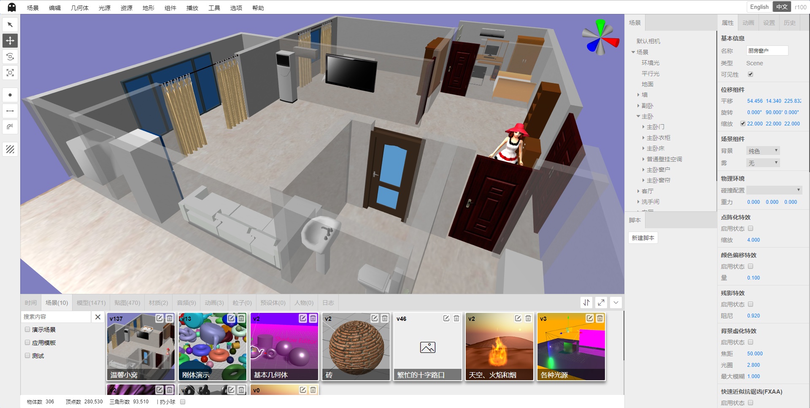

# Shadow Editor

Language: [中文](README.md) / [繁體中文](README-tw.md) / [English](README-en.md) / [日本語](README-jp.md) / Le français / [русский](README-ru.md)

* Nom: Editeur d'Ombre
* Version: v0.1.8 (en développement)
* Introduction: éditeur de scène basé sur `three.js`.

## v0.1.8 sera bientôt mis à jour

1. Placez le panneau de configuration dans le menu des options.
2. Ajout des filtres de teinte-rotation, saturation, luminosité, flou, contraste, niveaux de gris, inversion et sépia.
3. Les paramètres de filtre sont enregistrés dans la configuration de la scène et analysés dans l'éditeur et le lecteur.

## v0.1.7 Update

* Date de sortie: le 23 mars 2019
* Journal de mise à jour:

1. Une fois l'objet réparé, l'arborescence de la scène ne peut pas répondre à temps et le bogue indiquant que le nœud d'arborescence est développé et que les nœuds d'arborescence sont en panne ne peut pas être mémorisé.
2. Le nom de l'objet est trop long et les points de suspension sont automatiquement affichés. Déplacez la souris sur le noeud pour afficher le nom complet.
3. Ajout de la lecture en plein écran et de la lecture dans une nouvelle fenêtre. Le joueur et l'éditeur sont complètement découplés et le joueur peut courir indépendamment.
4. La scène modifiée peut être intégrée à l'iframe pour être exécutée. Adresse: `/view.html?SceneID=sceneID`. Cette adresse peut être obtenue à l’aide de la fonction de lecture nouvelle fenêtre.
5. Optimisation de l'effet de sélection d'objet: largeur égale.
6. Corrigez l'outil de génération et copiez le modèle sans copier tous les fichiers du dossier.
7. Tous les paramètres sont stockés dans `localStorage` et ne sont plus enregistrés dans la configuration de la scène.
8. Aide à la lumière parallèle reconstituée, aide à la lumière hémisphérique, aide à la lumière ponctuelle, aide à la lumière rectangulaire, aide aux projecteurs, pilotée par les événements, ne dépend plus fortement de l'éditeur.
9. Organisez la structure des dossiers. Réécrivez le module du panneau d'historique pour supprimer complètement le contrôle Outliner hautement couplé.
10. Optimisation de la traduction anglaise.
11. Ajoutez une fonction d’exportation en un clic pour analyser automatiquement les modèles et les ressources nécessaires à la scène.Toutes les ressources nécessaires sont placées dans le dossier `/temp/yyyyMMddHHmmss`.
12. Exportez la fonction d'édition sans ressources.
13. Re-publié le projet de démonstration: [Gitee](http://tengge1.gitee.io/shadoweditor-examples/) [GitHub](https://tengge1.github.io/ShadowEditor-examples/)
14. Corrigez les paramètres de rendu, ombre, entrée γ, sortie γ, bug de réglage du facteur gamma non valide.
15. Un seul point à la fois peut être dessiné pour les points, les lignes et les outils de pulvérisation dans l’avion.
16. Résolution d'un problème empêchant la lecture de l'animation interpolée.

## Capture d'écran du projet

Petit nid chaud.



[Cliquez ici](images/README.md) pour plus de captures d'écran.

<table>
    <tr>
        <td> Source </td>
        <td> <a href="https://github.com/tengge1/ShadowEditor"> GitHub </a> </td>
        <td> <a href="https://gitee.com/tengge1/ShadowEditor"> Nuage de code </a> </td>
        <td> Document </td>
        <td> <a href="https://tengge1.github.io/ShadowEditor/"> GitHub </a> </td>
        <td> <a href="https://tengge1.gitee.io/shadoweditor/"> Code Cloud </a> </td>
    </tr>
    <tr>
        <td> Démo </td>
        <td> <a href="https://tengge1.github.io/ShadowEditor-examples/"> GitHub </a> </td>
        <td> <a href="http://tengge1.gitee.io/shadoweditor-examples/"> Nuage de code </a> </td>
        <td> Bases de données et ressources </td>
        <td> <a href="https://pan.baidu.com/s/1VfgewDdoNP_N9VQQ4iUCeg" target="_blank"> Baidu Network Disk 20190116 </a> </td>
        <td> Code d'extraction: n8je </td>
    </tr>
</table>

## Fonction principale

1. Basé sur l'éditeur en ligne de scènes tridimensionnelles de three.js / WebGL, le serveur utilise `MongoDB` pour enregistrer l'animation, l'audio, la catégorie, le caractère, la texture, le matériau, le modèle de maillage, la particule, le corps prédéfini, les données de scène.
2. Géométrie intégrée: avion, cube, cercle, cylindre, sphère, icosaèdre, pneu, noeud, théière, verre à vin, elfe, texte; segment de droite, courbe de CatmullRom, courbe de Bézier quadratique, courbe de Bézier cubique , courbe elliptique.
3. Source lumineuse intégrée: lumière ambiante, lumière parallèle, source de lumière ponctuelle, projecteur, lumière hémisphérique, lumière rectangulaire.
4. Prend en charge divers modèles de formats 3D et importations d'animations. Supporte `3ds`,` 3mf`, `amf`,` assimp` (anim), `awd`,` babylon`, `binary`,` bvh` (anim), `collada`,` ctm`, `draco` , `fbx` (animer),` gcode`, `gltf` (animer),` js` (animer), `json` (animer),` kmz`, `lmesh` (animer),` md2`, `mmd `(anim),` nrrd`, `obj`,` pcd`, `pdb`,` ply`, `prwm`,` sea3d` (anim), `stl`,` vrm`, `vrml`,` vtk `,` x` 31 types de format de fichier 3D, avec le support de `anim` pour supporter l'animation. Une variété de fichiers 3D supporte les formats `json` et binaires. Le fichier `mmd` prend en charge les formats` pmd` et `pmx`, ainsi que les modèles et les animations de caméra au format `vmd`. C'est également le seul éditeur qui supporte `lmesh` (modèle de site Web lolking lol).
5. Matériaux intégrés: matériau de ligne, matériau en pointillé, matériau de base, matériau de profondeur, matériau de vecteur normal, matériau de Lambert, matériau de Fung, matériau de nuage de points, matériau standard, matériau physique, matériau de sprite, matériau de shader, shader brut Matériel.
6. Textures de soutien: texture de couleur, texture transparente, texture de relief, texture normale, texture de déplacement, texture de miroir, texture d’environnement, texture d’éclairage, texture d’occlusion, texture d’auto-illumination.
7. Texture de soutien: image, texture de cube, texture vidéo.
8. Composants intégrés: musique de fond, émetteurs de particules, ciel, flammes, eau, fumée, composants en tissu.
9. Modifiez visuellement les propriétés d'objets tels que des scènes et des caméras et fournissez plus de 40 panneaux de modification différents.
10. Éditez les scripts js et les programmes de shader en ligne avec des astuces intelligentes.
11. Apportez votre propre lecteur, effets dynamiques de scène de démonstration en temps réel, supporte la lecture plein écran et la nouvelle fenêtre, vous pouvez directement intégrer le projet `iframe`.
12. Supporte l'animation d'interpolation, l'animation squelettique, l'animation de particules, l'animation mmd, l'animation lmesh (modèle de site Web lolking lol).
13. Prise en charge des scènes, des modèles, des textures, des matériaux, de l'audio, de l'animation, des particules, des préréglages, de la gestion des ressources en caractères, d'une classification personnalisée et d'une recherche rapide-selon les caractères chinois et le pinyin. Parmi ceux-ci, la gestion des ressources de particule, de corps prédéfini et de rôle n'a pas encore atteint les fonctions correspondantes.
14. Prend en charge cinq types de contrôleurs: premier contrôleur de vue, contrôleur de vol, contrôleur de piste, contrôleur de verrouillage de pointeur et contrôleur de boule de commande.
15. Prend en charge les effets de matrice de points, les effets de décalage de couleur, les effets de rémanence d'image, le flou d'arrière-plan, l'anti-aliasing d'approximation rapide (FXAA), les effets de pépin, les effets de demi-teintes, l'anti-aliasing en plein écran (SSAA), les effets de pixel, la lumière ambiante Occlusion (SAO), anti-aliasing multi-échantillonnage (SMAA), occlusion ambiante d'espace écran (SSAO), anti-aliasing temporel (TAA).
16. Fournir des fonctions d'historique et de journalisation pour prendre en charge les fonctions d'annulation et de restauration.
17. Prise en charge de l’exportation des modèles `gltf`,` obj`, `ply`,` stl`.
18. Prise en charge du moteur physique `bullet`. Les composants rigides de la carrosserie sont supportés par des cubes, des cercles, des cylindres, des icosahédrons, des verres à vin, des avions, des sphères, des théières, des pneus, des nœuds et des modèles chargés. Prise en charge de la visualisation pour définir la forme du corps de la collision (carré, sphère), de la masse et de l'inertie.
19. Avec panoramique, rotation, zoom, tracé, points, lignes, décalcomanies sur la surface de l’objet, statistiques en temps réel du nombre d’objets, sommets, triangles.
20. Fonction d'exportation à une touche de scène de soutien.
21. Support bilingue chinois et anglais.
22. Prend en charge les filtres de teinte, de saturation, de luminosité, de flou, de contraste, de niveaux de gris, d'inversion et de sépia.
23. Prise en charge du contrôle de version.

## Guide de l'utilisateur

**Ce projet ne supporte que le système Windows, vous devez installer .Net Framework 4.5 sur votre ordinateur.**

**L'utilisation de la dernière version de Google Chrome n'est pas garantie. La compatibilité avec les autres navigateurs n'est pas garantie.**

1. Installez `NodeJs`. Dans le répertoire le plus à l'extérieur, exécutez la commande suivante.

```bash
NPM installer
Npm run build
```

2. Téléchargez `MongoDB` pour installer et démarrer le service MongoDB. Le port par défaut du service MongoDB est 27017.

```bash
Mongod --dbpath = D:\Mongodb\db --logpath = D:\Mongodb\log\mongoDB.log --install --serviceName MongoDB
Net start MongoDB
```

3. Modifiez le fichier `ShadowEditor.Web/Web.config` et remplacez `27017` par le port du service MongoDB sur votre ordinateur.

```xml
<add key="mongo_connection" value="mongodb://127.0.0.1:27017" />
```

4. Ouvrez le projet avec `Visual Studio 2017` et générez le projet `ShadowEditor.Web`.

5. Déployez `ShadowEditor.Web` sur iis pour y accéder dans le navigateur.

6. Afin de sauvegarder divers types de fichiers pour un téléchargement normal, vous devez ajouter les deux types MIME suivants sur iis.

| Extension de fichier | Type MIME | Description |
| --------- | -------- | ---- |
|. * | application / octet-stream | Divers fichiers de suffixes de format |
|. | application / octet-stream | Aucun fichier de suffixe |

7. Compilez la documentation, installez s'il vous plaît gitbook.

```bash
Npm installer -g gitbook-cli
```

Ensuite, basculez vers le répertoire `docs-dev` et installez le plugin gitbook.

```bash
Installation de Gitbook
```

Basculez ensuite vers le répertoire parent et exécutez la commande suivante pour générer le document.

```bash
Npm lance les build-docs
```

## FAQ

1. Pourquoi le téléchargement a-t-il échoué lors du téléchargement du modèle?

Les ressources telles que les mappes de modèles doivent être compressées dans un package zip et le fichier d'importation ne peut pas être imbriqué dans des dossiers. Le serveur extraira le paquet zip chargé dans le fichier `~/Upload/Model` et ajoutera une donnée à la table MongoDB `_Mesh`.

2. Comment combiner plusieurs modèles ensemble?

La géométrie de base prend en charge plusieurs niveaux d'imbrication. Vous pouvez ajouter un "groupe" (dans le menu géométrique) et faire glisser plusieurs modèles sur le "groupe" de l'arborescence.

## Journal de mise à jour

**v0.1.7**

* Date de sortie: le 23 mars 2019
* Journal de mise à jour:

1. Une fois l'objet réparé, l'arborescence de la scène ne peut pas répondre à temps et le bogue indiquant que le nœud d'arborescence est développé et que les nœuds d'arborescence sont en panne ne peut pas être mémorisé.
2. Le nom de l'objet est trop long et les points de suspension sont automatiquement affichés. Déplacez la souris sur le noeud pour afficher le nom complet.
3. Ajout de la lecture en plein écran et de la lecture dans une nouvelle fenêtre. Le joueur et l'éditeur sont complètement découplés et le joueur peut courir indépendamment.
4. La scène modifiée peut être intégrée à l'iframe pour être exécutée. Adresse: `/view.html?SceneID=sceneID`. Cette adresse peut être obtenue à l’aide de la fonction de lecture nouvelle fenêtre.
5. Optimisation de l'effet de sélection d'objet: largeur égale.
6. Corrigez l'outil de génération et copiez le modèle sans copier tous les fichiers du dossier.
7. Tous les paramètres sont stockés dans `localStorage` et ne sont plus enregistrés dans la configuration de la scène.
8. Aide à la lumière parallèle reconstituée, aide à la lumière hémisphérique, aide à la lumière ponctuelle, aide à la lumière rectangulaire, aide aux projecteurs, pilotée par les événements, ne dépend plus fortement de l'éditeur.
9. Organisez la structure des dossiers. Réécrivez le module du panneau d'historique pour supprimer complètement le contrôle Outliner hautement couplé.
10. Optimisation de la traduction anglaise.
11. Ajoutez une fonction d’exportation en un clic pour analyser automatiquement les modèles et les ressources nécessaires à la scène.Toutes les ressources nécessaires sont placées dans le dossier `/temp/yyyyMMddHHmmss`.
12. Exportez la fonction d'édition sans ressources.
13. Re-publié le projet de démonstration: [Gitee](http://tengge1.gitee.io/shadoweditor-examples/) [GitHub](https://tengge1.github.io/ShadowEditor-examples/)
14. Corrigez les paramètres de rendu, ombre, entrée γ, sortie γ, bug de réglage du facteur gamma non valide.
15. Un seul point à la fois peut être dessiné pour les points, les lignes et les outils de pulvérisation dans l’avion.
16. Résolution d'un problème empêchant la lecture de l'animation interpolée.

**v0.1.6**

* Date de sortie: 10 mars 2019
* Journal de mise à jour:

1. Utilisez `xtype.js` pour refactoriser le framework d'interface utilisateur de manière non intrusive.
2. Le cadre principal est repositionné en utilisant le positionnement absolu.
3. Le panneau inférieur prend en charge la maximisation et la restauration.
4. Le panneau du bas affiche les statistiques des ressources.
5. Collectionnez et triez un grand nombre de textures et de modèles.
6. Organisez l'outil de cartographie.
7. Organisez les outils de modèle.
8. Organisez l'outil de vignettes.
9. Ajoutez une source ponctuelle et non plus ajoutez des sphères et des halos par défaut.
10. Ajoutez l’hémisphère léger et non plus la Sky Ball par défaut.
11. Ajoutez une lumière rectangulaire et non plus un écran blanc rectangulaire par défaut.
12. Etant donné que l'effet de sélection d'origine a été obtenu en utilisant le «post-traitement», il s'est produit une perte de performance et un aliasing graves. Utilisez donc les méthodes `normal extrusion> et` template test` pour réimplémenter l'effet sélectionné.
13. L'effet sélectionné après la réécriture n'est plus irrégulier et la fonction d'anti-aliasing rapide (FXAA) n'est pas activée par défaut, ce qui améliore les performances. Pour les anciennes scènes, décochez la case "Rapide anti-aliasing (FXAA)" dans les propriétés de la scène et enregistrez à nouveau.
14. Par défaut, aucun shaders liés au post-traitement> et bibliothèques d'effets spéciaux associés ne sont chargés pour améliorer la vitesse de chargement.
15. Corrigez le bogue non terminé du commentaire du script de création.
16. Pliez la fonction du panneau inférieur.
17. Réécrivez le contrôle de l'arborescence de la scène pour prendre en charge le pliage, le glissement et la sélection.
18. Lorsque vous cliquez sur la scène pour sélectionner le modèle, l'arborescence de la scène donne la priorité à l'ensemble du modèle, qui ne fait pas partie du modèle, et se développe et se déplace automatiquement vers le modèle sélectionné.

**v0.1.5**

* Date de sortie: 23 février 2019
* Journal de mise à jour:

1. Segment de droite, courbe CatmullRom, courbe de Bézier quadratique, courbe de Bézier cubique, édition visuelle, enregistrement et chargement de la courbe elliptique.
2. Corrigez les bugs où l'animation sur la timeline ne peut pas être glissée.
3. Corrigez un bug empêchant de faire glisser un objet sur un groupe dans l'arborescence de la scène.
4. La géométrie de base prend en charge l'imbrication à plusieurs niveaux, ce qui peut enregistrer la charge normalement.
5. Corrigez le bogue de calcul de la taille du contrôle de perspective.
6. Corrigez les bogues où le contrôle de la vue peut être obscurci par d'autres objets.

**v0.1.4**

* Date de sortie: le 11 février 2019
* Journal de mise à jour:

1. Ajoutez un contrôle qui indique la direction.
2. Ajoutez des segments de droite, des courbes CatmullRom, des courbes de Bézier quadratiques, des courbes de Bézier cubiques, des courbes elliptiques. (Non pris en charge pour la sauvegarde)

**v0.1.3**

* Date de sortie: le 28 janvier 2019
* Journal de mise à jour:

1. Prise en charge multilingue: Prise en charge du chinois et de l'anglais, prise en charge du changement de langue dynamique.
2. Ajouter la géométrie de la courbe.

**v0.1.2**

* Date de sortie: le 11 janvier 2019
* Journal de mise à jour:

1. Ajout du contrôle de version à la scène. La table de scènes n'enregistre que la dernière scène et les données historiques sont enregistrées dans la table 'scene name_history`.
2. Enregistrez le matériau pour générer automatiquement une vignette de shader.
3. Enregistrez le matériau modifié chargé dans le modèle de serveur.
4. Un rectangle, un cercle, un cylindre, un icosaèdre, un verre à vin, un avion, une sphère, une théière, un pneu, un noeud et un modèle de chargement supportent tous des composants de carrosserie rigides. Prise en charge de la visualisation pour définir la forme du corps de la collision (carré, sphère), de la masse et de l'inertie.
5. Ajoutez un assistant de forme physique cube et sphère.

**v0.1.1**

* Date de sortie: 30 décembre 2018
* Journal de mise à jour:

1. Corrigez l'animation mmd et les problèmes de synchronisation audio. Prise en charge de plusieurs modèles mmd pour la synchronisation avec l'animation du modèle et l'animation de la caméra.
2. Ajout d'effets de matrice de points, effets de décalage de couleur, effets d'après-image, flou d'arrière-plan, anti-aliasing par approximation rapide (FXAA), effets de pépin, effets de demi-teintes, anti-aliasing en plein écran (SSAA), effets de pixel, environnement évolutif Occlusion de la lumière (SAO), anti-aliasing multi-échantillons (SMAA), ombrage de la lumière ambiante et espace-écran (SSAO), anti-aliasing temporel (TAA).
3. Ajoutez des particules, des préréglages et des panneaux de rôles. (fonctions spécifiques non encore implémentées)

**v0.1.0**

* Date de sortie: 15 décembre 2018
* Journal de mise à jour:

1. Réorganisez la fonction d'importation de modèle. Supporte actuellement `3ds`,` 3mf`, `amf`,` assimp` (anim), `awd`,` babylon`, `bvh` (anim),` collada`, `ctm`,` draco`, `fbx `(anim),` gcode`, `gltf` (anim),` js` (anim), `json` (anim),` kmz`, `lmesh` (anim),` md2`, `mmd` (anim ), `nrrd`,` obj`, `pcd`,` pdb`, `ply`,` prwm`, `sea3d` (anim),` stl`, `vrm`,` vrml`, `vtk`,` ` X` 31 types de formats de fichiers 3D avec une expression d'animation de prise en charge `anim`. Une variété de fichiers 3D supporte les formats `json` et binaires. Le fichier `mmd` prend en charge les formats` pmd` et `pmx`, ainsi que les modèles et les animations de caméra au format` vmd`. C'est également le seul éditeur qui supporte `lmesh` (modèle de site Web lolking lol).
2. Le joueur ajoute le premier contrôleur, le contrôleur de vol, le contrôleur de piste, le contrôleur de pointeur et les cinq contrôleurs dans le panneau de la caméra.
3. Panneau de scène, modifiez la classification de la scène et filtrez en temps réel selon la catégorie, le nom, le sort complet et les initiales pinyin.
4. Panneau Modèle, modifiez la classification du modèle, filtrez en temps réel selon la catégorie, le nom, le sort complet et les initiales pinyin.
5. Panneau Carte, éditez la classification de la carte et filtrez en temps réel en fonction de la catégorie, du nom, du sort complet et des initiales pinyin.
6. Panneau Matériau, modifiez la classification des matériaux, filtrez en temps réel selon la catégorie, le nom, le sortilège, les initiales pinyin.
7. Panneau audio, éditer la classification audio, filtrer en temps réel selon la catégorie, le nom, le sort complet, les initiales pinyin.
8. Composant de matériau, ajoutez un nouveau matériau et sélectionnez une fonction de matériau dans le panneau de matériau.
9. Textures, textures transparentes, textures en relief, textures normales, textures de remplacement, textures brutes, textures en métal, textures d'environnement, textures d'éclairage, textures d'occlusion, textures luminescentes Sélectionnez des textures dans le panneau Carte.
10. Supprimez la fenêtre de scène de version précédente, la fenêtre de modèle, la fenêtre de texture, la fenêtre audio.

**v0.0.9**

* Date de sortie: 25 novembre 2018
* Journal de mise à jour:

1. Ajoutez un chiffon avec une animation.
2. Le modèle gltf est importé avec animation.
3. Import de modèle de peau de corps (* .js) avec animation. (Le modèle a été supprimé du nouvel exemple three.js.)
4. Outils de dessin à plat.
5. Outil de dessin de ligne plate.
6. Outil de décalque d'avion.
7. Vérifiez l'optimisation de l'effet d'objet.

**v0.0.8**

* Date de sortie: le 27 octobre 2018
* Journal de mise à jour:

1. Mise à jour de la documentation de l'éditeur.
2. Le serveur de téléchargement de carte stéréo peut être défini comme arrière-plan de la scène.
3. Tous les scénarios publient un site Web statique en un clic, facile à déployer sur le service `GitHub Pages`.
4. Les composants de terrain de Berlin, la sérialisation et la désérialisation, et peuvent être affichés dans le lecteur.
5. Téléchargez la texture vidéo mp4 et définissez-la sur le matériau pour lire la vidéo dans la scène 3D.
6. Ajouter des composants de l'eau.

**v0.0.7**

* Date de sortie: 14 octobre 2018
* Journal de mise à jour:

1. Scène, modèle, texture, audio, fonction d'édition de ressources mmd, aperçu du téléchargement.
2. Fonction d'édition d'attributs de texture du matériau.
3. Le joueur est ré-architecturé.
4. Émetteur de particules, ciel, flamme, sauvegarde de la fumée, chargement, optimisation du jeu.
5. Le composant de corps rigide n'est plus ajouté par défaut mais est ajouté manuellement à partir du menu du composant.

**v0.0.6**

* Date de sortie: 30 septembre 2018
* Journal de mise à jour:

1. Fournir un support d'animation interpolée. Vous pouvez modifier visuellement l'animation interpolée sur la timeline et la lire dans le lecteur.
2. Ajout du modèle de téléchargement mmd (format pmd et pmx) et de l’animation mmd pouvant être lus dans le lecteur.
3. Ajout du modèle de téléchargement lmesh à jouer dans le lecteur.
4. Géométrie de base, source de lumière et package de terrain pour développement ultérieur.

**v0.0.5**

* Date de sortie: 16 septembre 2018
* Journal de mise à jour:

1. Modification de la présentation: le côté droit est remplacé par deux colonnes: la colonne de gauche fournit le diagramme de niveau de scène et la fonction de gestion de script js, et la colonne de droite les attributs, les paramètres et l’historique.
Ajoutez une modification d’animation (non terminée) sous la scène de modification et déplacez la vue du journal ici.
2. Transformation des composants du panneau Propriétés, ajout des informations de base, caméra, géométrie, source de lumière, matériau, émetteur de particules, configuration physique, scène, ombre,
Composants multiples tels que déplacement, moniteur audio, musique de fond, etc.
3. La musique de fond prend en charge le chargement de sauvegarde et fournit la gestion audio.
4. Fixez la fonction de programme d'édition du shader pour voir l'effet du shader en temps réel.
5. Ajoutez un composant d'édition de paramètre de théière.
6. Différentes géométries peuvent activer les réflexions.

**v0.0.4**

* Date de sortie: le 2 septembre 2018
* Journal de mise à jour:

1. Optimisation de l'édition de script, le script n'est plus lié à l'objet, il peut être enregistré et chargé avec la scène, en fournissant un exemple de script javascript, vertexShader, fragmentShader, programInfo. Les scripts personnalisés supportent `init`,` start`, `update`,` stop`, `onClick`,` onDblClick`, `onKeyDown`,` onKeyUp`, `onMouseDown`,` onMouseMove`, `onMouseUp`, `onMouseWheel`, `onResize` 13 événements.

2. L’arrière-plan prend en charge trois types différents de couleur unie, d’image d’arrière-plan et de texture stéréo, qui peuvent être enregistrés et chargés.

3. Ajout des paramètres d’affichage et de masquage pour 9 types d’aides pour grille, caméra, lumière ponctuelle, lumière parallèle, projecteur, lumière hémisphérique, lumière rectangulaire, assistant et os.

4. Ajoutez un panneau de journal.

5. Le miroir ajoute des effets de miroir spéciaux.

**v0.0.3**

* Date de sortie: 15 août 2018
* Journal de mise à jour:

1. Utilisez `asp.net` pour développer le serveur `web` et utilisez `MongoDB` pour enregistrer les données de modèle et de scène.
2. Téléchargez 15 modèles 3D de formats et enregistrez-les dans la scène.
3. Créez, enregistrez et chargez des scènes.
4. Groupe, 12 géométries intégrées, 5 types de sources lumineuses peuvent enregistrer la scène et la charge.
5. Sérialisation et désérialisation de 85 objets three.js.

**v0.0.2**

* Heure de parution: 9 juin 2018
* Journal de mise à jour:

1. Utilisez `rollup` pour refactoriser le code de l'éditeur intégré `three.js`.

**v0.0.1**

* Heure de parution: 21 juin 2017
* Journal de mise à jour:

1. Complétez principalement la traduction de l'éditeur intégré de three.js.

## Liens associés

* Site officiel de Three.js: https://threejs.org/
* LOL Model Viewer: https://github.com/tengge1/lol-model-viewer