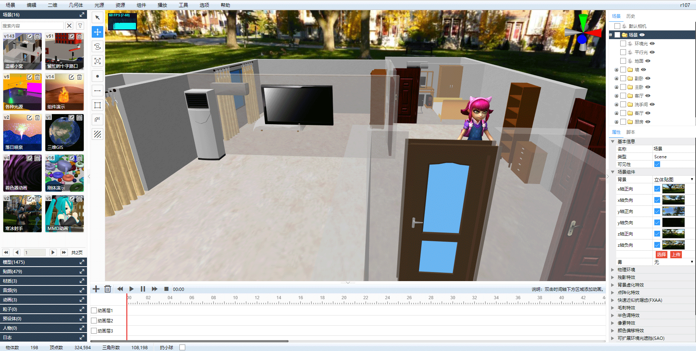

# Shadow Editor

Language: [中文](README.md) / 繁體中文 / [English](README-en.md)

* 名稱：Shadow Editor
* 版本：v0.3.0
* 簡介：基於`three.js`的場景編輯器。

## v0.3.0更新

* 發布日期：2019年8月11日
* 更新日誌：

1. 從`v0.3.0`開始，將發布基於`react.js`的新版編輯器，`v0.2.6_old`分支將於`2019年8月17日`刪除。
2. 除了補間動畫和少量bug外，新版編輯器已經達到舊版水平。
3. 跟舊版編輯器相比，新版有以下特點：
    1. 使用`react.js`重寫前端UI，界面美觀度提升，相應速度提升。
    2. 升級`three.js`到`r107`版本，`three.js`各組件也升級到最新版。
    3. 修復大量影響性能的bug和邏輯，渲染不再由事件驅動，渲染速度大幅提升。
    4. 支持模型內部組件名稱和位置的修改，支持將幾何體、組、光源等放到模型內部。
    5. 屬性面板分組可折疊，默認折疊一部分屬性組，方便使用。
    6. 資源面板放置到左側，支持分頁。資源數量多時，加載速度更快。
    7. 對火狐瀏覽器兼容性調整。
    8. 點擊場景樹狀圖右側的眼鏡圖標，可以快速對某個分支進行顯示隱藏控制。
    9. 根據瀏覽器語言，確定編輯器的初始語言。
4. 服務端和數據結構未作任何改動，如果您沒有改過前端的話，可以直接升級到新版。

## 項目截圖



<table>
    <tr>
        <td>源碼</td>
        <td><a href="https://github.com/tengge1/ShadowEditor">GitHub</a></td>
        <td><a href="https://gitee.com/tengge1/ShadowEditor">碼雲</a></td>
        <td>文檔</td>
        <td><a href="https://tengge1.github.io/ShadowEditor/">GitHub</a></td>
        <td><a href="https://tengge1.gitee.io/shadoweditor/">碼雲</a></td>
    </tr>
    <tr>
        <td>演示</td>
        <td><a href="https://tengge1.github.io/ShadowEditor-examples/">GitHub</a></td>
        <td><a href="http://tengge1.gitee.io/shadoweditor-examples/">碼雲</a></td>
        <td></td>
        <td></td>
        <td></td>
    </tr>
</table>

## 主要功能

> 說明：新版本部分功能可能尚未完成。

1. 基於three.js/WebGL的3D場景在線編輯器，服務端使用`MongoDB`保存動畫、音頻、類別、角色、貼圖、材質、網格模型、粒子、預設體、場景數據。
2. 內置幾何體：平面、正方體、圓、圓柱體、球體、二十面體、輪胎、紐結、茶壺、酒杯、精靈、文本；線段、CatmullRom曲線、二次貝塞爾曲線、三次貝塞爾曲線、橢圓曲線。
3. 內置光源：環境光、平行光、點光源、聚光燈、半球光、矩形光。
4. 支持多種不同3D格式模型和動畫導入。支持`3ds`、`3mf`、`amf`、`assimp`(anim)、`awd`、`babylon`、`binary`、`bvh`(anim)、`collada`、`ctm`、`draco` 、`fbx`(anim)、`gcode`、`gltf`(anim)、`js`(anim)、`json`(anim)、`kmz`、`lmesh`(anim)、`md2`、`mmd `(anim)、`nrrd`、`obj`、`pcd`、`pdb`、`ply`、`prwm`、`sea3d`(anim)、`stl`、`vrm`、`vrml`、`vtk `、`x` 31種3D文件格式，帶`anim`的表示支持動畫。多種3D文件同時支持`json`和二進制格式。 `mmd`文件同時支持`pmd`和`pmx`格式，支持`vmd`格式的模型和相機動畫。它也是唯一支持`lmesh`(lolking網站lol模型)的編輯器。
5. 內置材質：線條材質、虛線材質、基本材質、深度材質、法向量材質、蘭伯特材質、馮氏材質、點雲材質、標準材質、物理材質、精靈材質、著色器材質、原始著色器材質。
6. 支持紋理：顏色紋理、透明紋理、凹凸紋理、法線紋理、位移紋理、鏡面紋理、環境紋理、光照紋理、遮擋紋理、自發光紋理。
7. 支持貼圖：圖片、立方體貼圖、視頻貼圖。
8. 內置組件：背景音樂、粒子發射器、天空、火焰、水、煙、布組件。
9. 可視化修改場景、相機等物體屬性，提供40多種不同修改面板。
10. 在線編輯js腳本、著色器程序，帶智能提示。
11. 自帶播放器，實時演示場景動態效果，支持全屏和新窗口播放，可以直接嵌入項目`iframe`中。
12. 支持補間動畫、骨骼動畫、粒子動畫、mmd動畫、lmesh動畫（lolking網站lol模型）。
13. 支持場景、模型、貼圖、材質、音頻、動畫、粒子、預設體、角色資源管理，支持自定義分類，根據漢字和拼音快速搜索。其中，粒子、預設體、角色資源管理暫未實現相應功能。
14. 支持第一視角控制器、飛行控制器、軌道控制器、指針鎖定控制器、軌跡球控制器5種控制器。
15. 支持點陣化特效、顏色偏移特效、殘影特效、背景虛化、快速近似抗鋸齒(FXAA)、毛刺特效、半色調特效、全屏抗鋸齒(SSAA)、像素特效、可擴展環境光遮擋(SAO)、多重採樣抗鋸齒(SMAA)、屏幕空間環境光遮蔽(SSAO)、時間抗鋸齒(TAA)。
16. 提供歷史記錄和日誌功能，支持撤銷、重做。
17. 支持導出`gltf`、`obj`、`ply`、`stl`模型。
18. 支持`bullet`物理引擎。正方體、圓形、圓柱體、二十面體、酒杯、平面、球體、茶壺、輪胎、紐結和加載的模型都支持剛體組件。支持可視化設置碰撞體形狀（正方體、球體）、質量和慣性。
19. 具有平移、旋轉、縮放、在物體表面繪製點、線、貼花的工具，實時統計場景種物體、頂點、三角形數量。
20. 支持場景一鍵導出功能。
21. 中英文雙語支持。
22. 支持色調旋轉(hue-rotate)、飽和度、亮度、高斯模糊(blur)、對比度、灰度、顏色反轉(invert)、復古(sepia)濾鏡。
23. 支持版本控制。

## 使用指南

**該項目僅支持Windows系統，電腦上需要安裝.Net Framework 4.5。**

**推薦使用最新版谷歌瀏覽器，不保證兼容其他瀏覽器。**

1. 安裝`NodeJs`，在最外層目錄，執行以下命令。

```bash
npm install
npm run build
```

2. 下載`MongoDB`，安裝並啟動MongoDB服務。 MongoDB服務的默認端口為27017。

MongoDB下載地址:https://www.mongodb.com/download-center/community

可以下載zip版本，然後在MongoDB的bin文件夾執行以下命令安裝服務，注意修改路徑。

```bash
mongod --dbpath=D:\mongodb\db --logpath=D:\mongodb\log\mongoDB.log --install --serviceName MongoDB
net start MongoDB
```

3. 編輯文件`ShadowEditor.Web/Web.config`，將`27017`修改為你電腦上MongoDB服務的端口。

```xml
<add key="mongo_connection" value="mongodb://127.0.0.1:27017" />
```

4. 使用`Visual Studio 2017`打開項目，生成`ShadowEditor.Web`項目。

5. 將`ShadowEditor.Web`部署在iis上即可在瀏覽器中訪問。

6. 為了保存各種類型文件能正常下載，會在iis上添加以下兩個MIME類型，正式部署請注意安全。

| 文件擴展名 | MIME類型 | 說明 |
| --------- | -------- | ---- |
| .* | application/octet-stream | 各種格式後綴文件 |
| . | application/octet-stream | 無後綴文件 |

7. 編譯文檔，請安裝gitbook。

```bash
npm install -g gitbook-cli
```

然後切換到`docs-dev`目錄，安裝gitbook插件。

```bash
gitbook install
```

然後切換到上級目錄，執行以下命令生成文檔。

```bash
npm run build-docs
```

## 常見問題

1. 上傳模型時為什麼都是上傳失敗？

需要把模型貼圖等資源壓縮成一個zip包，而且入口文件不能嵌套文件夾。服務端會解壓上傳的zip包放到`~/Upload/Model`文件下，並在MongoDB `_Mesh`表裡添加一條數據。

2. 如何將多個模型組合在一起？

基本幾何體都支持多層嵌套。可以添加一個`組`（在幾何體菜單中），然後在場景樹狀圖上，將多個模型拖動到`組`上。

## 相關鏈接

* Three.js官網：https://threejs.org/
* LOL模型查看器：https://github.com/tengge1/lol-model-viewer
* 模型下載1：https://sketchfab.com/3d-models?features=downloadable
* 模型下載2：https://www.3dpunk.com/work/index.html?category=downloadable