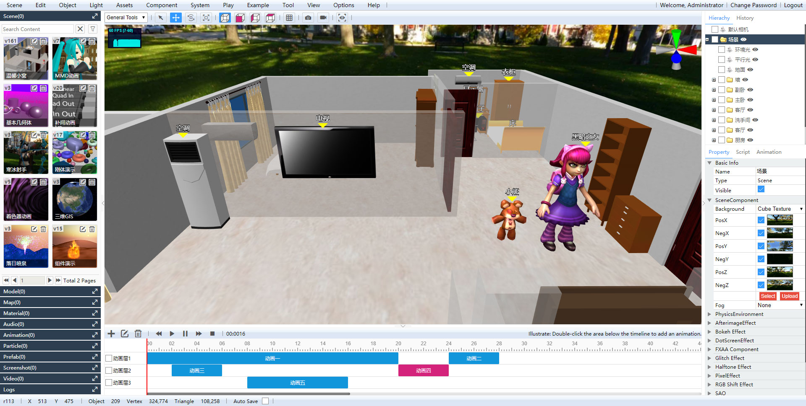

# Shadow Editor

English / [中文](README_zh.md)

> [Click](../../tree/v0.4.6-csharp/) to switch to `C#` branch, which is no longer maintained.

* Name: Shadow Editor
* Version: v0.5.1 (coming soon)
* Description: Cross-platform 3D scene editor based on three.js, golang and mongodb.
* Source: [GitHub](https://github.com/tengge1/ShadowEditor) [Gitee](https://gitee.com/tengge1/ShadowEditor) | Document: [GitHub](https://tengge1.github.io/ShadowEditor/) [Gitee](https://tengge1.gitee.io/shadoweditor/) | Demo: [GitHub](https://tengge1.github.io/ShadowEditor-examples/) [Gitee](http://tengge1.gitee.io/shadoweditor-examples/) | Video: [Weibo](https://weibo.com/tv/v/IjIn9AyvX?fid=1034:4446986821107725) [Bilibili](https://www.bilibili.com/video/av78428475?from=search&seid=9203731141485399611) | Assets: [BaiduNetdisk](https://pan.baidu.com/s/1IxJVM6fFLoIAJG-GKHjVTA)
* Technology Stack: html, css, javascript, rollup, react.js, webgl, three.js, golang, mongodb.
* If helpful to you, please [DOnate](https://gitee.com/tengge1/ShadowEditor) to support us. thank you!



## v0.5.1 is Coming Soon

1. Fix a bug that an error occurs when the scene plays which contains a smoke comopnent.
2. Fix the bug of renderer size error. (It causes smoke shrink when the scene plays which contains a smoke component)
3. Fix the bug of water component error, due to the upgrade of three.js.
4. Fix a bug that the category filter on the assets panel lists all the categories on Ubuntu.
5. Fix bugs of listing fonts, uploading fonts and creating 3D text.
6. Fix the bug of backing up mongodb.
7. Update Windows build guide. [See Detail](#build-on-windows)

## v0.5.0 has Released

* Release Date: May 5, 2020
* Update Logs:

1. Rewrite the server using golang.
2. Fix a bug that `draco` models cannot be loaded due to the upgrade of `three.js`.
3. Models in `.json` format are no longer supported.
4. Fix a bug that the bottom row of the category list window is blocked by the button.
5. Fix a bug that the diffuse map cannot be loaded when it attaches to a geometry.
6. Fix a bug that thumbnails cannot be set for audio, screenshot and video resources.
7. Fix a bug that confirmation dialog cannot be closed with cancel and close button.
8. Fix a bug that the role list will not refresh after deleting a role.

Compared with `asp.net`, `golang` has many advantages:

1. Support both `Windows`, `Linux` and `Mac`.
2. Similar to C language. support `goroutine`, which take great advantages of multi-core, and have high performance.
3. Easy to learn. Huge standard libraries and third-party libraries, and high development efficiency.
4. Can compiled into a single file, and when publish, no need to install `golang` nor `nodejs` when publishing.
5. No `iis` required.
6. Network data is compressed with `gzip`, and the speed of displaying and scene loading is really fast.
7. No `Visual Studio` required. You can develop with `Visual Studio Code` for both the server and web.

Upgrade from C# version:

The data structure and web client is not changed, just copy `./ShadowEditor.Web/Upload/` folder to
`build/public/Upload/`.

## Features

1. Cross-platform: `Windows`, `Linux`, `Mac`; and supports desktop and web versions.
2. It supports many 3D formats: `3ds`, `3mf`, `amf`, `assimp`(anim), `awd`, `babylon`, `binary`, `bvh`(anim), `collada`, `ctm`, `draco` , `fbx`(anim), `gcode`, `gltf`(`gltf` and `glb`, anim), `js`(anim), `kmz`, `lmesh`(anim), `md2`, `mmd`(`pmd` and `pmx`, anim), `nrrd`, `obj`, `pcd`, `pdb`, `ply`, `prwm`, `sea3d`(anim), `stl`, `vrm`, `vrml`, `vtk`, `X`. (anim) means it supports animation.
3. Built-in objects: group; plane, cube, circle, cylinder, sphere, icosahedron, torus, torus knot, teapot, lathe; unscaled text, 3D text; line segments, CatmullRom curve, quadratic Bezier curve, cubic Bezier curve, ellipse curve; point marks; arrow helper, axes helper; sprite.
4. Built-in lights: ambient light, directional light, point light, spotlight, hemispherical light, rect area light.
5. Built-in components: background music, particle emitter, sky, fire, water, smoke, cloth, berlin terrain, sky sphere.
6. Support materials: LineBasicMaterial, LineDashedMaterial, MeshBasicMaterial, MeshDepthMaterial, MeshNormalMaterial, MeshLambertMaterial, MeshPhongMaterial, PointsMaterial, MeshStandardMaterial, MeshPhysicalMaterial, SpriteMaterial, ShaderMaterial, RawShaderMaterial.
7. Edit javascript, shader program and json with intelligence.
8. Live player can play animations in the scene.
9. Exporting `gltf`, `obj`, `ply`, `stl`, `Collada`, `DRACO` models.
10. Publish scene as static resources, and can be embedded in `iframe`.
11. Support languages: `English`, `中文`, `繁體中文`, `日本語`, `한국어`, `русский`, `Le français`.
12. Scene version management: supporting history and logs, undo and redo, auto saving.
13. Authority management: organization, user, role, authority, registration, login, and password modification.
14. Resource management: scene, mesh, texture, material, audio, animation, screenshot, video, typeface.

## Requirements

1. MongoDB v3.6.8+
2. Chrome 81.0+ or ​​Firefox 75.0+

The following only required when you want to build from the source.

1. Golang 1.14.2+
2. NodeJS 14.1+
3. gcc 9.3.0+ (`tdm-gcc`, `MinGW-w64` or `MinGW` on Windows, and make sure `gcc` can be accessed through the command line)
4. git 2.25.1+
5. VSCode 1.44.2+
6. make 4.2.1+ (Linux only)

**Note:** The version number is for reference only.

## Download and Compile

You can use git to download the source code.

```bash
git clone https://github.com/tengge1/ShadowEditor.git
```

In **China**, `github` is really slow, you can use `gitee` instead.

```bash
git clone https://gitee.com/tengge1/ShadowEditor.git
```

If you need a C# version, you can checkout the `v0.4.6-csharp` branch which is no longer maintained. 
[Click](../../tree/v0.4.6-csharp/) to see the install guide.

```bash
git checkout -b csharp origin/v0.4.6-csharp
```

### Build on Ubuntu

You can use `make` to build this application on ubuntu. If you have no `make`, 
run `sudo apt install make` first.

1. If you are in `China`, run `make proxy` to set golang and nodejs proxy.
2. Run `make` to build the server and web.
3. Edit `build/config.toml`, and modify the database host and port.
4. Run `make run` to launch the server. You can now visit: `http://localhost:2020`.

### Build on Windows

1. If you are in `China`, double click `set_proxy.bat` in the `scripts` folder.
2. Double click `build.bat` in the `scripts` folder.
3. Edit `config.toml` in the `build` folder, and modify the database host and port.
4. Double click `ShadowEditor.exe` in the `build` folder. You can now visit: `http://localhost:2020`.

### Build using Command Line

1. If you are in `China`, set golang and nodejs proxy.

```bash
go env -w GO111MODULE=on
go env -w GOPROXY=https://goproxy.cn
npm config set registry https://registry.npm.taobao.org/
```

2. Install go dependencies, build the server, and copy config file.

Ubuntu:

```bash
cd server
go env -w GO111MODULE=on
go install
go build -o ../build/ShadowEditor
cp config.toml ../build
cd ../
```

Windows:

```bash
cd server
go env -w GO111MODULE=on
go install
go build -o ../build/ShadowEditor.exe
copy .\config.toml ..\build
cd ../
```

3. Install nodejs dependencies, build the web client, and copy assets.

Ubuntu:

```bash
cd web
npm install
npm run build
cp -r ./assets ../build/public/assets
cp -r ./locales ../build/public/locales
cp ./favicon.ico ../build/public/favicon.ico
cp ./index.html ../build/public/index.html
cp ./manifest.json ../build/public/manifest.json
cp ./sw.js ../build/public/sw.js
cp ./view.html ../build/public/view.html
cd ../
```

Windows:

```bash
cd web
npm install
npm run build
xcopy /e /q /y assets ..\build\public\assets\
xcopy /e /q /y locales ..\build\public\locales\
copy favicon.ico ..\build\public\favicon.ico
copy index.html ..\build\public\index.html
copy manifest.json ..\build\public\manifest.json
copy sw.js ..\build\public\sw.js
copy view.html ..\build\public\view.html
cd ../
```

4. Edit `build/config.toml`, and modify the database host and port.

5. Launch the server.

Ubuntu: 

```bash
cd build
./ShadowEditor serve --config ./config.toml
```

Windows:

```bash
cd build
.\ShadowEditor.exe serve --config .\config.toml
```

Now, you see the output and can visit in browser: `http://localhost:2020`

```
2020/05/05 17:06:57 starting shadoweditor server on port :2020
[negroni] 2020-05-05T17:07:10+08:00 | 304 | 	 64.607µs | localhost:2020 | GET /
[negroni] 2020-05-05T17:07:10+08:00 | 304 | 	 71.204µs | localhost:2020 | GET /build/ShadowEditor.css
[negroni] 2020-05-05T17:07:10+08:00 | 304 | 	 70.964µs | localhost:2020 | GET /assets/js/libs/react.js
[negroni] 2020-05-05T17:07:10+08:00 | 304 | 	 36.198µs | localhost:2020 | GET /assets/js/libs/gunzip.js
[negroni] 2020-05-05T17:07:10+08:00 | 304 | 	 35.328µs | localhost:2020 | GET /assets/js/libs/ammo.js
[negroni] 2020-05-05T17:07:10+08:00 | 304 | 	 47.253µs | localhost:2020 | GET /assets/js/three.js
```

## Frequently Asked Questions

1. Failed when upload models.

You need to compress the model assets into a `zip` file, and the entry file cannot be nested in a folder. The server will decompress and put it in the `./build/public/Upload/Model` folder, and add a record in the MongoDB `_Mesh` collection.

2. How to combine multiple models together?

Basic geometry supports multiple levels of nesting. You can add a `group` (in the geometry menu), and then drag multiple models onto the `group` in the `Hierachy` Panel.

3. How to enable authority?

Edit `config.toml` and set `authority.enabled` to `true`. The default administrator username is `admin` and the password is `123456`.

4. The brower report `asm.js has been disabled because the script debugger is connected. Please disconnect the debugger to enable asm.js.` Error.

**Complete error**: asm.js has been disabled because the script debugger is connected. Please disconnect the debugger to enable asm.js. ammo.js (1,1) SCRIPT1028: SCRIPT1028: Expected identifier, string or number ShadowEditor.js (3948,8) SCRIPT5009: 'Shadow' is not defined.

**Solution**: Tencent browser does not support `ammo.js` (WebAssembly) compiled with `Emscripten`, it is recommended to use `Chrome` or `Firebox` instead.

## License

MIT License

## Related Links

* Three.js: https://threejs.org/
* Golang: https://golang.org/
* Golang (In China): https://golang.google.cn/
* MongoDB: https://www.mongodb.com/
* LOL model viewer: https://github.com/tengge1/lol-model-viewer
* Model download1: https://sketchfab.com/3d-models?features=downloadable
* Model download2: https://www.3dpunk.com/work/index.html?category=downloadable