# Shadow Editor

* 名称：Shadow Editor
* 版本：v0.1.0（开发中）
* 说明：基于`three.js`的场景编辑器。

* 源码一：https://gitee.com/tengge1/ShadowEditor
* 源码二：https://github.com/tengge1/ShadowEditor

* 文档一：https://tengge1.gitee.io/shadoweditor/
* 文档二：https://tengge1.github.io/ShadowEditor/

* 示例一：https://tengge1.gitee.io/shadoweditor-examples/
* 示例二：https://tengge1.github.io/ShadowEditor-examples/

* 推荐使用最新版谷歌浏览器查看示例，不保证兼容其他浏览器。

## 主要功能

1. 3D场景在线编辑。
2. 内置多种几何体、光源，场景支持雾效、影子、反光、背景图片等。
3. 支持导入多种不同格式的3D模型。
4. 服务端使用`MongoDB`保存模型和场景数据。
5. 可视化修改场景、相机、几何体、材质、纹理、音频播放器、粒子发射器等属性。
6. js脚本、着色器脚本在线编辑，带智能提示。
7. 自带播放器，实时演示场景动态效果。
8. 支持补间动画、骨骼动画、粒子动画，支持mmd动画，支持lmesh动画。

## 使用方法

**该项目仅支持Windows系统，电脑上需要安装.Net Framework 4.5。**

1. 安装`NodeJs`，在当前目录，执行以下命令。

```bash
npm install
npm run build
```

2. 下载`MongoDB`，安装并启动MongoDB服务。MongoDB服务的默认端口为27017。

```bash
mongod --dbpath=D:\mongodb\db --logpath=D:\mongodb\log\mongoDB.log --install --serviceName MongoDB
net start MongoDB
```

3. 编辑文件`ShadowEditor.Web/Web.config`，将`27017`修改为你电脑上MongoDB服务的端口。

```xml
<add key="mongo_connection" value="mongodb://127.0.0.1:27017" />
```

4. 使用`Visual Studio 2017`打开项目，生成`ShadowEditor.Web`项目。

5. 将`ShadowEditor.Web`部署在iis上即可在浏览器中访问。

6. 为了保存各种类型文件能正常下载，需要在iis上添加以下两个MIME类型。

| 文件扩展名 | MIME类型 | 说明 |
| --------- | -------- | ---- |
| .* | application/octet-stream | 各种格式后缀文件 |
| . | application/octet-stream | 无后缀文件 |

7. 编译文档，请安装gitbook。

```bash
npm install -g gitbook-cli
```

然后切换到`docs-dev`目录，安装gitbook插件。

```bash
gitbook install
```

然后切换到上级目录，执行以下命令生成文档。

```bash
npm run build-docs
```

## 项目截图


<table>
    <tr valign="top">
        <td width="25%">平板<br>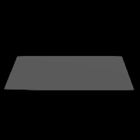</td>
        <td width="25%">正方体<br>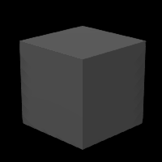</td>
        <td width="25%">圆<br>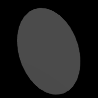</td>
        <td width="25%">圆柱体<br>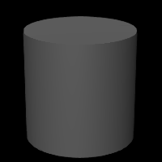</td>
    </tr>
    <tr valign="top">
        <td>球体<br>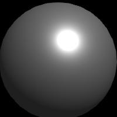</td>
        <td>二十面体<br>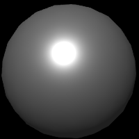</td>
        <td>轮胎<br>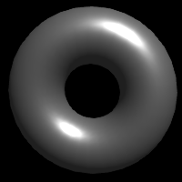</td>
        <td>纽结<br>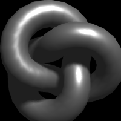</td>
    </tr>
    <tr valign="top">
        <td>茶壶<br>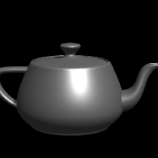</td>
        <td>酒杯<br></td>
        <td>精灵<br>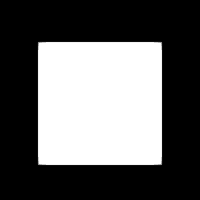</td>
        <td>文本<br></td>
    </tr>
    <tr valign="top">
        <td>环境光<br>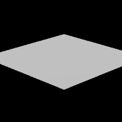</td>
        <td>平行光<br>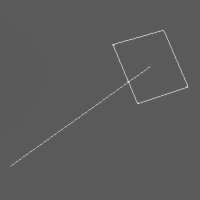</td>
        <td>点光源<br>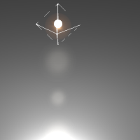</td>
        <td>聚光灯<br>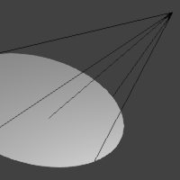</td>
    </tr>
    <tr valign="top">
        <td>半球光<br>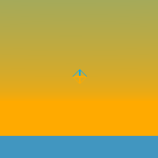</td>
        <td>矩形光<br>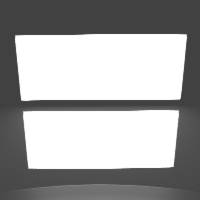</td>
        <td></td>
        <td></td>
    </tr>
    <tr valign="top">
        <td>基本材质<br>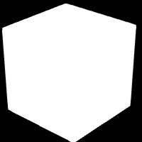</td>
        <td>冯氏材质<br>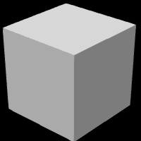</td>
        <td>兰伯特材质<br>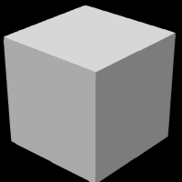</td>
        <td>标准材质<br>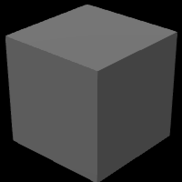</td>
    </tr>
    <tr valign="top">
        <td>物理材质<br>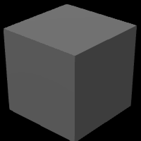</td>
        <td>法向量材质<br>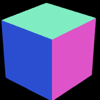</td>
        <td></td>
        <td></td>
    </tr>
    <tr valign="top">
        <td>火焰<br>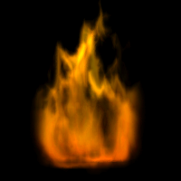</td>
        <td>水<br>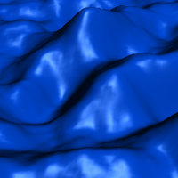</td>
        <td>烟<br>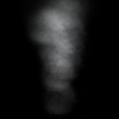</td>
        <td>布<br>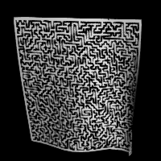</td>
    </tr>
    <tr valign="top">
        <td>天空<br>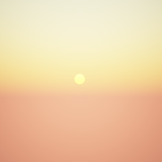</td>
        <td>粒子发射器<br>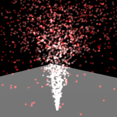</td>
        <td>柏林地形<br>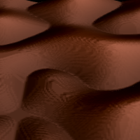</td>
        <td>着色器地形<br>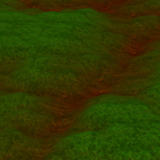</td>
    </tr>
</table>

## 相关链接

* 更多截图：[点此查看](images/README.md)
* 更新日志：[点此查看](UpdateLog.md)
* Three.js官网：https://threejs.org/
* Three.js源码：https://github.com/mrdoob/three.js/
* LOL模型查看器：https://github.com/tengge1/lol-model-viewer