# Shadow Editor

* 名称：Shadow Editor
* 版本：v0.1.0（开发中）
* 简介：基于`three.js`的场景编辑器。

<table>
    <tr>
        <td>源码</td>
        <td><a href="https://github.com/tengge1/ShadowEditor">GitHub</a></td>
        <td><a href="https://gitee.com/tengge1/ShadowEditor">码云</a></td>
        <td>文档</td>
        <td><a href="https://tengge1.github.io/ShadowEditor/">GitHub</a></td>
        <td><a href="https://tengge1.gitee.io/shadoweditor/">码云</a></td>
    </tr>
    <tr>
        <td>演示</td>
        <td><a href="https://tengge1.github.io/ShadowEditor-examples/">GitHub</a></td>
        <td><a href="https://tengge1.gitee.io/shadoweditor/">码云</a></td>
        <td></td>
        <td><a href="UserGuide.md">安装指南</a></td>
        <td><a href="UpdateLog.md">更新日志</a></td>
    </tr>
</table>

## 主要功能

1. 3D场景在线编辑。
2. 内置多种几何体、光源，支持雾效、阴影、反光、背景图等。
3. 支持多种不同格式的3D模型。
4. 服务端使用`MongoDB`保存模型和场景数据。
5. 可视化修改场景、相机、几何体、材质、纹理和各种组件属性。
6. js脚本、着色器在线编辑，带智能提示。
7. 自带播放器，实时演示场景动态效果。
8. 支持补间动画、骨骼动画、粒子动画、mmd动画、lmesh动画等。

## 项目截图

<table>
    <tr valign="top">
        <td width="25%">平板 </td>
        <td width="25%">正方体 </td>
        <td width="25%">圆 </td>
        <td width="25%">圆柱体 </td>
    </tr>
    <tr valign="top">
        <td>球体 </td>
        <td>二十面体 </td>
        <td>轮胎 </td>
        <td>纽结 </td>
    </tr>
    <tr valign="top">
        <td>茶壶 </td>
        <td>酒杯 </td>
        <td>精灵 </td>
        <td>文本 </td>
    </tr>
    <tr valign="top">
        <td>环境光 </td>
        <td>平行光 </td>
        <td>点光源 </td>
        <td>聚光灯 </td>
    </tr>
    <tr valign="top">
        <td>半球光 </td>
        <td>矩形光 </td>
        <td></td>
        <td></td>
    </tr>
    <tr valign="top">
        <td>基本材质 </td>
        <td>冯氏材质 </td>
        <td>兰伯特材质 </td>
        <td>标准材质 </td>
    </tr>
    <tr valign="top">
        <td>物理材质 </td>
        <td>法向量材质 </td>
        <td></td>
        <td></td>
    </tr>
    <tr valign="top">
        <td>火焰 </td>
        <td>水 </td>
        <td>烟 </td>
        <td>布 </td>
    </tr>
    <tr valign="top">
        <td>天空 </td>
        <td>粒子发射器 </td>
        <td>柏林地形 </td>
        <td>着色器地形 </td>
    </tr>
    <tr valign="top">
        <td>画点 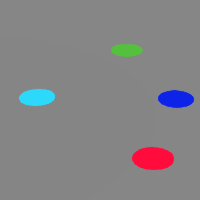</td>
        <td>画线 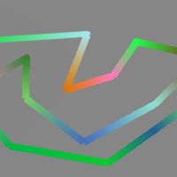</td>
        <td>贴花 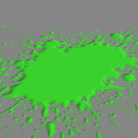</td>
        <td></td>
    </tr>
    <tr valign="top">
        <td>3ds模型 </td>
        <td>3mf模型 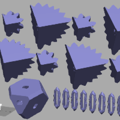</td>
        <td>amf模型 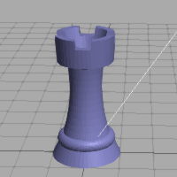</td>
        <td>assimp模型(anim) </td>
    </tr>
    <tr valign="top">
        <td>awd模型 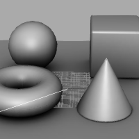</td>
        <td>babylon模型 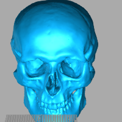</td>
        <td>bvh模型(anim) 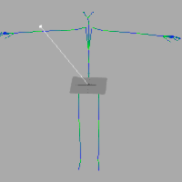</td>
        <td>collada模型 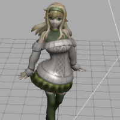</td>
    </tr>
    <tr valign="top">
        <td>ctm模型 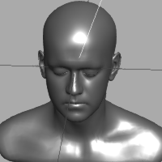</td>
        <td>draco模型 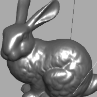</td>
        <td>fbx模型(anim) 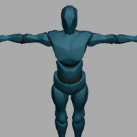</td>
        <td>gcode模型 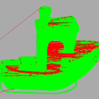</td>
    </tr>
    <tr valign="top">
        <td>gltf模型(anim) 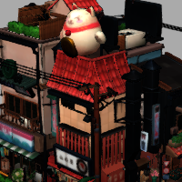</td>
        <td>js模型(anim) 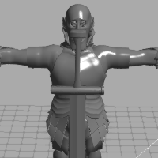</td>
        <td>json模型(anim) 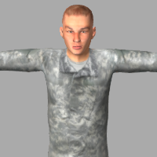</td>
        <td>kmz模型 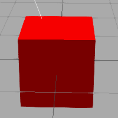</td>
    </tr>
    <tr valign="top">
        <td>lmesh模型(anim) 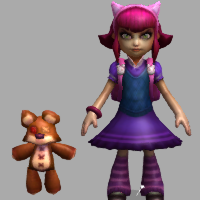</td>
        <td>md2模型 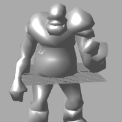</td>
        <td>mmd模型(anim) 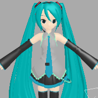</td>
        <td>obj模型 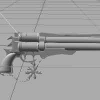</td>
    </tr>
    <tr valign="top">
        <td>lmesh模型(anim) </td>
        <td>nrrd模型 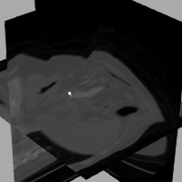</td>
        <td>pcd模型 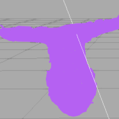</td>
        <td>pdb模型 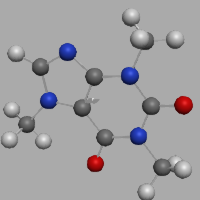</td>
    </tr>
</table>

说明：带`anim`标注的是支持动画的模型。

## 相关链接

* Three.js官网：https://threejs.org/
* LOL模型查看器：https://github.com/tengge1/lol-model-viewer