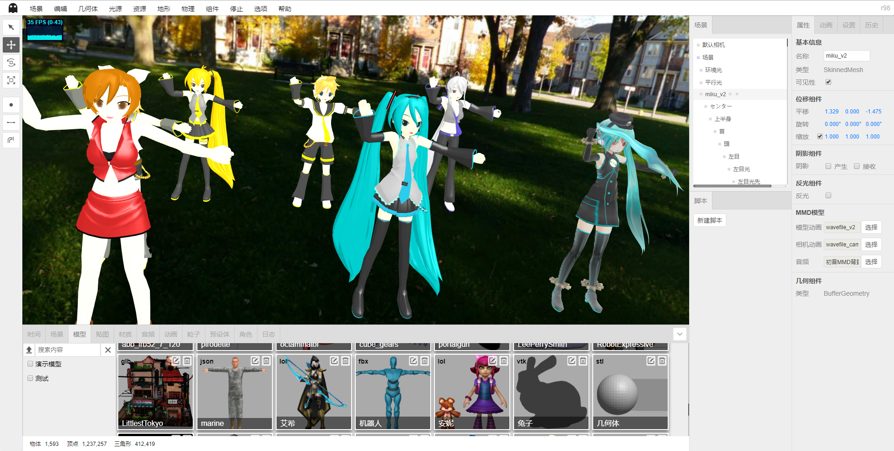

# Shadow Editor

* 名称：Shadow Editor
* 版本：v0.1.1（开发中）
* 简介：基于`three.js`的场景编辑器。

<table>
    <tr>
        <td>源码</td>
        <td><a href="https://github.com/tengge1/ShadowEditor">GitHub</a></td>
        <td><a href="https://gitee.com/tengge1/ShadowEditor">码云</a></td>
        <td>文档</td>
        <td><a href="https://tengge1.github.io/ShadowEditor/">GitHub</a></td>
        <td><a href="https://tengge1.gitee.io/shadoweditor/">码云</a></td>
    </tr>
    <tr>
        <td>演示</td>
        <td><a href="https://tengge1.github.io/ShadowEditor-examples/">GitHub</a></td>
        <td><a href="https://tengge1.gitee.io/shadoweditor/">码云</a></td>
        <td></td>
        <td><a href="UserGuide.md">安装指南</a></td>
        <td><a href="UpdateLog.md">更新日志</a></td>
    </tr>
</table>

## v0.1.1 即将更新

1. 修复mmd动画和音频不同步问题。支持多个mmd模型与模型动画、相机动画同步。
2. 新增点阵化特效、颜色偏移特效、残影特效、背景虚化、快速近似抗锯齿(FXAA)、毛刺特效、半色调特效、全屏抗锯齿(SSAA)、像素特效、可扩展环境光遮挡(SAO)、多重采样抗锯齿(SMAA)、屏幕空间环境光遮蔽(SSAO)。
3. 新增粒子、预设体、角色面板。（暂未实现具体功能）

## 主要功能

1. 基于three.js/WebGL的3D场景在线编辑器，服务端使用`MongoDB`保存动画、音频、类别、角色、贴图、材质、网格模型、粒子、预设体、场景数据。
2. 内置几何体：平面、正方体、圆、圆柱体、球体、二十面体、轮胎、纽结、茶壶、酒杯、精灵、文本。
3. 内置光源：环境光、平行光、点光源、聚光灯、半球光、矩形光。点光源增加发光体和光晕特效；半球光增加天空特效；矩形光增加发光体特效。
4. 支持多种不同3D格式模型和动画导入。支持`3ds`、`3mf`、`amf`、`assimp`(anim)、`awd`、`babylon`、`bvh`(anim)、`collada`、`ctm`、`draco`、`fbx`(anim)、`gcode`、`gltf`(anim)、`js`(anim)、`json`(anim)、`kmz`、`lmesh`(anim)、`md2`、`mmd`(anim)、`nrrd`、`obj`、`pcd`、`pdb`、`ply`、`prwm`、`sea3d`(anim)、`stl`、`vrm`、`vrml`、`vtk`、`x` 31种3D文件格式，带`anim`的表示支持动画。多种3D文件同时支持`json`和二进制格式。`mmd`文件同时支持`pmd`和`pmx`格式，支持`vmd`格式的模型和相机动画。它也是唯一支持`lmesh`(lolking网站lol模型)的编辑器。
5. 内置材质：线条材质、虚线材质、基本材质、深度材质、法向量材质、兰伯特材质、冯氏材质、点云材质、标准材质、物理材质、精灵材质、着色器材质、原始着色器材质。
6. 支持纹理：颜色纹理、透明纹理、凹凸纹理、法线纹理、位移纹理、镜面纹理、环境纹理、光照纹理、遮挡纹理、自发光纹理。
7. 支持贴图：图片、立方体贴图、视频贴图。
8. 内置组件：背景音乐、粒子发射器、天空、火焰、水、烟、布、刚体组件。
9. 可视化修改场景、相机等物体属性，提供40多种不同修改面板。
10. 在线编辑js脚本、着色器程序，带智能提示。
11. 自带播放器，实时演示场景动态效果，播放音频。
12. 支持补间动画、骨骼动画、粒子动画、mmd动画、lmesh动画（lolking网站lol模型）。
13. 支持场景、模型、贴图、材质、音频、动画、粒子、预设体、角色资源管理，支持自定义分类，根据汉字和拼音快速搜索。其中，粒子、预设体、角色资源管理暂未实现相应功能。
14. 支持第一视角控制器、飞行控制器、轨道控制器、指针锁定控制器、轨迹球控制器5种控制器。
15. 支持点阵化、颜色偏移、残影、背景虚化多种特效。
16. 提供历史记录和日志功能，支持撤销、重做。
17. 支持导出`gltf`、`obj`、`ply`、`stl`模型。
18. 支持地形：柏林地形、着色器地形。现仅提供示例，待开发完善。
19. 支持`bullet`物理引擎。现仅提供示例，待开发完善
20. 具有平移、旋转、缩放、在物体表面绘制点、线、贴花的工具，实时统计场景种物体、顶点、三角形数量。

## 项目截图

大型舞会现场。

[点击此处](images/README.md)查看更多截图。

## 相关链接

* Three.js官网：https://threejs.org/
* LOL模型查看器：https://github.com/tengge1/lol-model-viewer