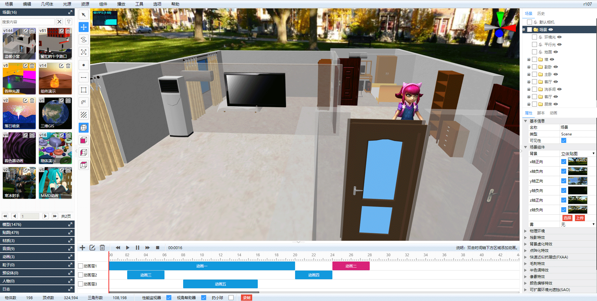

# Shadow Editor

Supported Languages: 中文 / [繁體中文](README-tw.md) / [English](README-en.md) / 日本語 / 한국어 / русский / Le français

* 名称：Shadow Editor
* 版本：v0.4.0（开发中）
* 简介：基于`three.js`的场景编辑器。
* 源码：[GitHub](https://github.com/tengge1/ShadowEditor) [Gitee](https://gitee.com/tengge1/ShadowEditor) | 文档：[GitHub](https://tengge1.github.io/ShadowEditor/) [Gitee](https://tengge1.gitee.io/shadoweditor/) | 示例：[GitHub](https://tengge1.github.io/ShadowEditor-examples/) [Gitee](http://tengge1.gitee.io/shadoweditor-examples/) | 视频：[微博](https://weibo.com/tv/v/IjIn9AyvX?fid=1034:4446986821107725) [Bilibili](https://www.bilibili.com/video/av78428475?from=search&seid=9203731141485399611) | 资源：[百度云](https://pan.baidu.com/s/1IxJVM6fFLoIAJG-GKHjVTA)
* 开发计划：小场景搭建、地形编辑、模型批量添加渲染、地表植被附属物编辑、物理引擎、数据可视化。
* 如果对您有帮助，请[【捐赠】](https://gitee.com/tengge1/ShadowEditor)支持项目发展，谢谢。

## v0.4.0即将更新

1. 新增距离测量工具。
2. 新增导出场景到JSON文件功能。
3. 新增导出场景到Collada文件功能。
4. 新增导出场景到OBJ文件功能。
5. 新增导出场景到PLY文件功能。
6. 新增导出场景到STL文件功能。
7. 修复标注对话框点击关闭，然后点击确定，报错的bug。
8. 修复播放MMD动画报错的bug。
9. 载入历史版本场景功能。

## v0.3.9更新【[更新日志](docs-dev/update/UpdateLog.md)】

* 发布日期：2019年12月15日
* 更新日志：

1. 修复不缩放文字显示模糊的bug。
2. 修复浏览器窗口缩放后，鼠标放到物体上，高亮不准的bug。
3. 修复浏览器窗口缩放后，文件大小发生改变bug。
4. 修复物体平移旋转缩放后，鼠标放到物体上，高亮不准的bug。
5. 移除`d3.js`，不再使用`d3`开发可视化功能，使用`d3-dispatch`代替完整版`d3.js`。
6. 点标注改为不会缩放的三角形标注，可以正常保存载入和通过属性面板修改文字。
7. 选中效果由保存在场景中，改为保存在浏览器上。
8. 鼠标高亮效果，改为保存在浏览器上，默认不开启。可以通过选项、显示菜单设置是否开启高亮和高亮颜色。
9. 优化消息弹窗，不再遮挡编辑区，使用背景和文字颜色区分`消息`、`成功`、`警告`、`错误`四种情景。
10. 修复正投影下，鼠标hover高亮不正确bug。
11. 制作功能演示视频：[微博](https://weibo.com/tv/v/IjIn9AyvX?fid=1034:4446986821107725) [Bilibili](https://www.bilibili.com/video/av78428475?from=search&seid=9203731141485399611) [百度云](https://pan.baidu.com/s/1qfRHot4H7ip26KLbQuBeVg)
12. 修复录制视频过程中，切换工具栏，导致录制视频失败的bug。
13. 新增`打砖块`、`相机`、`粒子`、`乒乓球`、`着色器`示例。(three.js自带)
14. 新增天气设置：无、下雨、下雪。

## 技术分享

1. three.js使用卷积法实现物体描边效果：https://www.cnblogs.com/tengge/p/11924006.html
2. three.js使用gpu选取物体并计算交点位置：https://www.cnblogs.com/tengge/p/11924663.html
3. 使用three.js创建大小不随着场景变化的文字：https://www.cnblogs.com/tengge/p/11979854.html
4. three.js各种材质的实现源码：https://www.cnblogs.com/tengge/p/12037574.html

## 项目截图



## 主要功能

1. 基于three.js/WebGL的3D场景在线编辑器，服务端使用`MongoDB`保存动画、音频、类别、角色、贴图、材质、网格模型、粒子、预设体、场景数据。
2. 内置几何体：平面、正方体、圆、圆柱体、球体、二十面体、轮胎、纽结、茶壶、酒杯、精灵、文本；线段、CatmullRom曲线、二次贝塞尔曲线、三次贝塞尔曲线、椭圆曲线。
3. 内置光源：环境光、平行光、点光源、聚光灯、半球光、矩形光。
4. 支持多种不同3D格式模型和动画导入。支持`3ds`、`3mf`、`amf`、`assimp`(anim)、`awd`、`babylon`、`binary`、`bvh`(anim)、`collada`、`ctm`、`draco`、`fbx`(anim)、`gcode`、`gltf`(anim)、`js`(anim)、`json`(anim)、`kmz`、`lmesh`(anim)、`md2`、`mmd`(anim)、`nrrd`、`obj`、`pcd`、`pdb`、`ply`、`prwm`、`sea3d`(anim)、`stl`、`vrm`、`vrml`、`vtk`、`x` 31种3D文件格式，带`anim`的表示支持动画。多种3D文件同时支持`json`和二进制格式。`mmd`文件同时支持`pmd`和`pmx`格式，支持`vmd`格式的模型和相机动画。它也是唯一支持`lmesh`(lolking网站lol模型)的编辑器。
5. 内置材质：线条材质、虚线材质、基本材质、深度材质、法向量材质、兰伯特材质、冯氏材质、点云材质、标准材质、物理材质、精灵材质、着色器材质、原始着色器材质。
6. 支持纹理：颜色纹理、透明纹理、凹凸纹理、法线纹理、位移纹理、镜面纹理、环境纹理、光照纹理、遮挡纹理、自发光纹理。
7. 支持贴图：图片、立方体贴图、视频贴图。
8. 内置组件：背景音乐、粒子发射器、天空、火焰、水、烟、布组件。
9. 可视化修改场景、相机等物体属性，提供40多种不同修改面板。
10. 在线编辑js脚本、着色器程序，带智能提示。
11. 自带播放器，实时演示场景动态效果，支持全屏和新窗口播放，可以直接嵌入项目`iframe`中。
12. 支持补间动画、骨骼动画、粒子动画、mmd动画、lmesh动画（lolking网站lol模型）。
13. 支持场景、模型、贴图、材质、音频、动画、粒子、预设体、截图、视频管理，支持自定义分类，根据汉字和拼音快速搜索。其中，粒子、预设体暂未实现相应功能。
14. 支持第一视角控制器、飞行控制器、轨道控制器、指针锁定控制器、轨迹球控制器5种控制器。
15. 支持点阵化特效、颜色偏移特效、残影特效、背景虚化、快速近似抗锯齿(FXAA)、毛刺特效、半色调特效、全屏抗锯齿(SSAA)、像素特效、可扩展环境光遮挡(SAO)、多重采样抗锯齿(SMAA)、屏幕空间环境光遮蔽(SSAO)、时间抗锯齿(TAA)。
16. 提供历史记录和日志功能，支持撤销、重做。
17. 支持导出`gltf`、`obj`、`ply`、`stl`、`Collada`、`DRACO`模型。
18. 支持`bullet`物理引擎。正方体、圆形、圆柱体、二十面体、酒杯、平面、球体、茶壶、轮胎、纽结和加载的模型都支持刚体组件。支持可视化设置碰撞体形状（正方体、球体）、质量和惯性。
19. 具有平移、旋转、缩放、在物体表面绘制点、线、贴花的工具，实时统计场景种物体、顶点、三角形数量。
20. 支持场景发布功能，可以将场景发布成静态资源，部署到任何一台服务器上。
21. 软件内置语言：`中文`、`繁體中文`、`English`、`日本語`、`한국어`、`русский`、`Le français`。
22. 支持色调旋转(hue-rotate)、饱和度、亮度、高斯模糊(blur)、对比度、灰度、颜色反转(invert)、复古(sepia)滤镜。
23. 支持版本控制。
24. 支持截图工具，视频录制工具。
25. 内置权限管理：组织机构管理、用户管理、角色管理、权限管理、系统初始化、系统重置、注册、登录、修改密码。

## 使用指南

**该项目仅支持Windows系统，电脑上需要安装.Net Framework 4.5。**

**兼容火狐和谷歌浏览器，推荐使用最新版谷歌浏览器。**

1. 安装`NodeJs`，在最外层目录，执行以下命令。

```bash
npm install
npm run build
```

2. 下载`MongoDB`，安装并启动MongoDB服务。MongoDB服务的默认端口为27017。

MongoDB下载地址:https://www.mongodb.com/download-center/community

可以下载zip版本，然后在MongoDB的bin文件夹执行以下命令安装服务，注意修改路径。

```bash
mongod --dbpath=D:\mongodb\db --logpath=D:\mongodb\log\mongoDB.log --install --serviceName MongoDB
net start MongoDB
```

3. 编辑文件`ShadowEditor.Web/Web.config`，将`27017`修改为你电脑上MongoDB服务的端口。

```xml
<add key="mongo_connection" value="mongodb://127.0.0.1:27017" />
```

4. 使用`Visual Studio 2017`打开项目，生成`ShadowEditor.Web`项目。

5. 将`ShadowEditor.Web`部署在iis上即可在浏览器中访问。

注意：发布网站部署，Web目录外面需要多加一层文件夹，用于存放日志、数据库备份等不能公开的资源。

6. 为了保存各种类型文件能正常下载，会在iis上添加以下两个MIME类型，正式部署请注意安全。

| 文件扩展名 | MIME类型 | 说明 |
| --------- | -------- | ---- |
| .* | application/octet-stream | 各种格式后缀文件 |
| . | application/octet-stream | 无后缀文件 |

7. 编译文档，请安装gitbook。

```bash
npm install -g gitbook-cli
```

然后切换到`docs-dev`目录，安装gitbook插件。

```bash
gitbook install
```

然后切换到上级目录，执行以下命令生成文档。

```bash
npm run docs
```

## 常见问题

1. 上传模型时为什么都是上传失败？

需要把模型贴图等资源压缩成一个zip包，而且入口文件不能嵌套文件夹。服务端会解压上传的zip包放到`~/Upload/Model`文件下，并在MongoDB `_Mesh`表里添加一条数据。

2. 如何将多个模型组合在一起？

基本几何体都支持多层嵌套。可以添加一个`组`（在几何体菜单中），然后在场景树状图上，将多个模型拖动到`组`上。

3. 如何开启权限系统？

打开`ShadowEditor.Web/Web.config`文件，将`EnableAuthority`设置为`true`。默认管理员用户名是`admin`，密码是`123456`。

## 相关链接

* Three.js官网：https://threejs.org/
* LOL模型查看器：https://github.com/tengge1/lol-model-viewer
* 模型下载1：https://sketchfab.com/3d-models?features=downloadable
* 模型下载2：https://www.3dpunk.com/work/index.html?category=downloadable