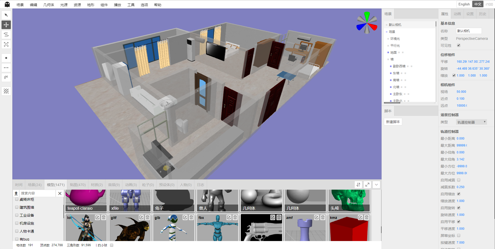

# Shadow Editor

Language: 中文 / [English](README-en.md)

* 名称：Shadow Editor
* 版本：v0.1.6(开发中)
* 简介：基于`three.js`的场景编辑器。

## v0.1.6即将更新

1. 使用`xtype.js`，采用非侵入式开发方式重构UI框架。
2. 主框架使用绝对定位重新布局。
3. 底部面板支持最大化和还原。
4. 底部面板显示资源统计信息。
5. 搜集整理大量贴图和模型，并进行分类。
6. 整理贴图工具。
7. 整理模型工具。
8. 整理缩略图工具。

## v0.1.5更新

* 发布日期：2019年2月23日
* 更新日志：

1. 线段、CatmullRom曲线、二次贝塞尔曲线、三次贝塞尔曲线、椭圆曲线可视化编辑、保存和载入。
2. 修复时间轴上的动画无法拖动的bug。
3. 修复无法在场景树状视图将物体拖动到组上的bug。
4. 基本几何体都支持多层嵌套，可以正常保存载入。
5. 修复视角控件尺寸计算bug。
6. 修复视角控件可能被其他物体遮挡的bug。

<table>
    <tr>
        <td>源码</td>
        <td><a href="https://github.com/tengge1/ShadowEditor">GitHub</a></td>
        <td><a href="https://gitee.com/tengge1/ShadowEditor">码云</a></td>
        <td>文档</td>
        <td><a href="https://tengge1.github.io/ShadowEditor/">GitHub</a></td>
        <td><a href="https://tengge1.gitee.io/shadoweditor/">码云</a></td>
    </tr>
    <tr>
        <td>演示</td>
        <td><a href="https://tengge1.github.io/ShadowEditor-examples/">GitHub</a></td>
        <td><a href="https://tengge1.gitee.io/shadoweditor/">码云</a></td>
        <td>数据库及资源</td>
        <td><a href="https://pan.baidu.com/s/1VfgewDdoNP_N9VQQ4iUCeg" target="_blank">百度网盘20190116</a></td>
        <td>提取码：n8je</td>
    </tr>
</table>

## 主要功能

1. 基于three.js/WebGL的3D场景在线编辑器，服务端使用`MongoDB`保存动画、音频、类别、角色、贴图、材质、网格模型、粒子、预设体、场景数据。
2. 内置几何体：平面、正方体、圆、圆柱体、球体、二十面体、轮胎、纽结、茶壶、酒杯、精灵、文本；线段、CatmullRom曲线、二次贝塞尔曲线、三次贝塞尔曲线、椭圆曲线。
3. 内置光源：环境光、平行光、点光源、聚光灯、半球光、矩形光。点光源增加发光体和光晕特效；半球光增加天空特效；矩形光增加发光体特效。
4. 支持多种不同3D格式模型和动画导入。支持`3ds`、`3mf`、`amf`、`assimp`(anim)、`awd`、`babylon`、`binary`、`bvh`(anim)、`collada`、`ctm`、`draco`、`fbx`(anim)、`gcode`、`gltf`(anim)、`js`(anim)、`json`(anim)、`kmz`、`lmesh`(anim)、`md2`、`mmd`(anim)、`nrrd`、`obj`、`pcd`、`pdb`、`ply`、`prwm`、`sea3d`(anim)、`stl`、`vrm`、`vrml`、`vtk`、`x` 31种3D文件格式，带`anim`的表示支持动画。多种3D文件同时支持`json`和二进制格式。`mmd`文件同时支持`pmd`和`pmx`格式，支持`vmd`格式的模型和相机动画。它也是唯一支持`lmesh`(lolking网站lol模型)的编辑器。
5. 内置材质：线条材质、虚线材质、基本材质、深度材质、法向量材质、兰伯特材质、冯氏材质、点云材质、标准材质、物理材质、精灵材质、着色器材质、原始着色器材质。
6. 支持纹理：颜色纹理、透明纹理、凹凸纹理、法线纹理、位移纹理、镜面纹理、环境纹理、光照纹理、遮挡纹理、自发光纹理。
7. 支持贴图：图片、立方体贴图、视频贴图。
8. 内置组件：背景音乐、粒子发射器、天空、火焰、水、烟、布、刚体组件。
9. 可视化修改场景、相机等物体属性，提供40多种不同修改面板。
10. 在线编辑js脚本、着色器程序，带智能提示。
11. 自带播放器，实时演示场景动态效果，播放音频。
12. 支持补间动画、骨骼动画、粒子动画、mmd动画、lmesh动画（lolking网站lol模型）。
13. 支持场景、模型、贴图、材质、音频、动画、粒子、预设体、角色资源管理，支持自定义分类，根据汉字和拼音快速搜索。其中，粒子、预设体、角色资源管理暂未实现相应功能。
14. 支持第一视角控制器、飞行控制器、轨道控制器、指针锁定控制器、轨迹球控制器5种控制器。
15. 支持点阵化特效、颜色偏移特效、残影特效、背景虚化、快速近似抗锯齿(FXAA)、毛刺特效、半色调特效、全屏抗锯齿(SSAA)、像素特效、可扩展环境光遮挡(SAO)、多重采样抗锯齿(SMAA)、屏幕空间环境光遮蔽(SSAO)、时间抗锯齿(TAA)。
16. 提供历史记录和日志功能，支持撤销、重做。
17. 支持导出`gltf`、`obj`、`ply`、`stl`模型。
18. 支持地形：柏林地形、着色器地形。现仅提供示例，待开发完善。
19. 支持`bullet`物理引擎。正方体、圆形、圆柱体、二十面体、酒杯、平面、球体、茶壶、轮胎、纽结和加载的模型都支持刚体组件。支持可视化设置碰撞体形状（正方体、球体）、质量和惯性。
20. 具有平移、旋转、缩放、在物体表面绘制点、线、贴花的工具，实时统计场景种物体、顶点、三角形数量。

## 项目截图

温馨小窝。



[点击此处](images/README.md)查看更多截图。

## 使用指南

**该项目仅支持Windows系统，电脑上需要安装.Net Framework 4.5。**

**推荐使用最新版谷歌浏览器，不保证兼容其他浏览器。**

1. 安装`NodeJs`，在当前目录，执行以下命令。

```bash
npm install
npm run build
```

2. 下载`MongoDB`，安装并启动MongoDB服务。MongoDB服务的默认端口为27017。

```bash
mongod --dbpath=D:\mongodb\db --logpath=D:\mongodb\log\mongoDB.log --install --serviceName MongoDB
net start MongoDB
```

3. 编辑文件`ShadowEditor.Web/Web.config`，将`27017`修改为你电脑上MongoDB服务的端口。

```xml
<add key="mongo_connection" value="mongodb://127.0.0.1:27017" />
```

4. 使用`Visual Studio 2017`打开项目，生成`ShadowEditor.Web`项目。

5. 将`ShadowEditor.Web`部署在iis上即可在浏览器中访问。

6. 为了保存各种类型文件能正常下载，需要在iis上添加以下两个MIME类型。

| 文件扩展名 | MIME类型 | 说明 |
| --------- | -------- | ---- |
| .* | application/octet-stream | 各种格式后缀文件 |
| . | application/octet-stream | 无后缀文件 |

7. 编译文档，请安装gitbook。

```bash
npm install -g gitbook-cli
```

然后切换到`docs-dev`目录，安装gitbook插件。

```bash
gitbook install
```

然后切换到上级目录，执行以下命令生成文档。

```bash
npm run build-docs
```

## 常见问题

1. 发布静态网站功能不能用。

Shadow Editor需要服务端支持，请按照[使用指南](#使用指南)配置好相关环境。

2. 上传模型时为什么都是上传失败？

需要把模型贴图等资源压缩成一个zip包，而且入口文件不能嵌套文件夹。服务端会解压上传的zip包放到`~/Upload/Model`文件下，并在MongoDB `_Mesh`表里添加一条数据。

3. 如何将多个模型组合在一起？

基本几何体都支持多层嵌套。可以添加一个`组`（在几何体菜单中），然后在场景树状图上，将多个模型拖动到`组`上。

## 更新日志

**v0.1.5**

* 发布日期：2019年2月23日
* 更新日志：

1. 线段、CatmullRom曲线、二次贝塞尔曲线、三次贝塞尔曲线、椭圆曲线可视化编辑、保存和载入。
2. 修复时间轴上的动画无法拖动的bug。
3. 修复无法在场景树状视图将物体拖动到组上的bug。
4. 基本几何体都支持多层嵌套，可以正常保存载入。
5. 修复视角控件尺寸计算bug。
6. 修复视角控件可能被其他物体遮挡的bug。

**v0.1.4**

* 发布日期：2019年2月11日
* 更新日志：

1. 新增一个指示方向的控件。
2. 新增线段、CatmullRom曲线、二次贝塞尔曲线、三次贝塞尔曲线、椭圆曲线。(暂不支持保存)

**v0.1.3**

* 发布日期：2019年1月28日
* 更新日志：

1. 多语言支持：支持中文和英文，支持语言动态切换。
2. 新增曲线几何体。

**v0.1.2**

* 发布日期：2019年1月11日
* 更新日志：

1. 场景新增版本控制。场景表仅保存最新场景，历史数据保存在`场景名称_history`表中。
2. 保存材质自动生成材质球缩略图。
3. 保存载入服务端模型修改后的材质。
4. 正方体、圆形、圆柱体、二十面体、酒杯、平面、球体、茶壶、轮胎、纽结、加载模型都支持刚体组件。支持可视化设置碰撞体形状（正方体、球体）、质量和惯性。
5. 新增正方体和球体物理形状帮助器。

**v0.1.1**

* 发布日期：2018年12月30日
* 更新日志：

1. 修复mmd动画和音频不同步问题。支持多个mmd模型与模型动画、相机动画同步。
2. 新增点阵化特效、颜色偏移特效、残影特效、背景虚化、快速近似抗锯齿(FXAA)、毛刺特效、半色调特效、全屏抗锯齿(SSAA)、像素特效、可扩展环境光遮挡(SAO)、多重采样抗锯齿(SMAA)、屏幕空间环境光遮蔽(SSAO)、时间抗锯齿(TAA)。
3. 新增粒子、预设体、角色面板。（暂未实现具体功能）

**v0.1.0**

* 发布日期：2018年12月15日
* 更新日志：

1. 重新梳理模型导入功能。目前支持`3ds`、`3mf`、`amf`、`assimp`(anim)、`awd`、`babylon`、`bvh`(anim)、`collada`、`ctm`、`draco`、`fbx`(anim)、`gcode`、`gltf`(anim)、`js`(anim)、`json`(anim)、`kmz`、`lmesh`(anim)、`md2`、`mmd`(anim)、`nrrd`、`obj`、`pcd`、`pdb`、`ply`、`prwm`、`sea3d`(anim)、`stl`、`vrm`、`vrml`、`vtk`、`x` 31种3D文件格式，带`anim`的表示支持动画。多种3D文件同时支持`json`和二进制格式。`mmd`文件同时支持`pmd`和`pmx`格式，支持`vmd`格式的模型和相机动画。它也是唯一支持`lmesh`(lolking网站lol模型)的编辑器。
2. 播放器新增`第一视角控制器`、`飞行控制器`、`轨道控制器`、`指针锁定控制器`、`轨迹球控制器`5种控制器，在相机面板设置。
3. 场景面板，编辑场景分类，根据类别、名称、全拼、拼音首字母实时过滤。
4. 模型面板，编辑模型分类，根据类别、名称、全拼、拼音首字母实时过滤。
5. 贴图面板，编辑贴图分类，根据类别、名称、全拼、拼音首字母实时过滤。
6. 材质面板，编辑材质分类，根据类别、名称、全拼、拼音首字母实时过滤。
7. 音频面板，编辑音频分类，根据类别、名称、全拼、拼音首字母实时过滤。
8. 材质组件，新增保存材质和从材质面板选择材质功能。
9. 纹理、透明纹理、凹凸纹理、法线纹理、置换纹理、粗糙纹理、金属纹理、环境纹理、光照纹理、遮挡纹理、发光纹理从贴图面板选择贴图功能。
10. 删除上个版本场景窗口、模型窗口、贴图窗口、音频窗口。

**v0.0.9**

* 发布日期：2018年11月25日
* 更新日志：

1. 新增布料带动画。
2. gltf模型导入带动画。
3. skinned morph(*.js)模型导入带动画。(新版three.js示例中已经移除该模型。)
4. 平面画点工具。
5. 平面画线工具。
6. 平面贴花工具。
7. 选中物体效果优化。

**v0.0.8**

* 发布日期：2018年10月27日
* 更新日志：

1. 编辑器文档更新。
2. 立体贴图上传服务端，并可设置为场景背景。
3. 所有场景一键发布静态网站，便于部署到`GitHub Pages`服务上。
4. 柏林地形组件、序列化和反序列化，并可在播放器中展示。
5. 上传mp4视频贴图，并可以设置到材质上，在三维场景中播放视频。
6. 增加水组件。

**v0.0.7**

* 发布日期：2018年10月14日
* 更新日志：

1. 场景、模型、纹理、音频、mmd资源编辑功能，可上传预览图。
2. 材质纹理属性编辑功能。
3. 播放器重新架构。
4. 粒子发射器、天空、火焰、烟保存、载入、播放优化。
5. 刚体组件不再默认添加，改为从组件菜单中手动添加。

**v0.0.6**

* 发布日期：2018年9月30日
* 更新日志：

1. 提供补间动画支持。可以在时间轴上可视化修改补间动画，并在播放器中播放。
2. 新增上传mmd模型（pmd和pmx格式）和mmd动画，可以在播放器中播放。
3. 新增上传lmesh模型，可在播放器中播放。
4. 基本几何体、光源、地形封装，便于进一步开发。

**v0.0.5**

* 发布日期：2018年9月16日
* 更新日志：

1. 布局修改：右侧改为两栏，左边栏提供场景层次图和js脚本管理功能，右边栏是属性、设置和历史面板。
在编辑场景下方新增动画编辑（未完成），并把日志查看移动到这里。
2. 属性面板组件化改造，新增基本信息、相机、几何体、光源、材质、粒子发射器、物理配置、场景、影子、
位移、音频监听器、背景音乐等多个组件。
3. 背景音乐支持保存载入，提供音频管理。
4. 修复编辑着色器程序功能，实时查看着色器效果。
5. 新增茶壶参数编辑组件。
6. 各种几何体都可以开启反射。

**v0.0.4**

* 发布日期：2018年9月2日
* 更新日志：

1. 脚本编辑优化，脚本不再跟物体绑定，可以跟场景一起保存载入，提供javascript、vertexShader、fragmentShader、programInfo示例脚本。自定义脚本支持`init`、`start`、`update`、`stop`、`onClick`、`onDblClick`、`onKeyDown`、`onKeyUp`、`onMouseDown`、`onMouseMove`、
`onMouseUp`、`onMouseWheel`、`onResize` 13种事件。

2. 背景支持纯色、背景图片、立体贴图三种不同类型，可以保存载入。

3. 新增网格、相机、点光源、平行光、聚光灯、半球光、矩形光、帮助器、骨骼9种帮助器的显示隐藏设置。

4. 新增日志面板。

5. 平板新增镜面特效。

**v0.0.3**

* 发布日期：2018年8月15日
* 更新日志：

1. 使用`asp.net`开发`web`服务端，使用`MongoDB`保存模型和场景数据。
2. 15种格式3D模型的上传，并可以保存到场景。
3. 场景的创建、保存、载入。
4. 组、12种内置几何体、5种光源可以保存场景并载入。
5. 85种three.js对象的序列化和反序列化。

**v0.0.2**

* 发布时间：2018年6月9日
* 更新日志：

1. 使用`rollup`重构`three.js`自带编辑器的代码。

**v0.0.1**

* 发布时间：2017年6月21日  
* 更新日志：

1. 主要完成three.js自带编辑器的翻译。

## 相关链接

* Three.js官网：https://threejs.org/
* LOL模型查看器：https://github.com/tengge1/lol-model-viewer