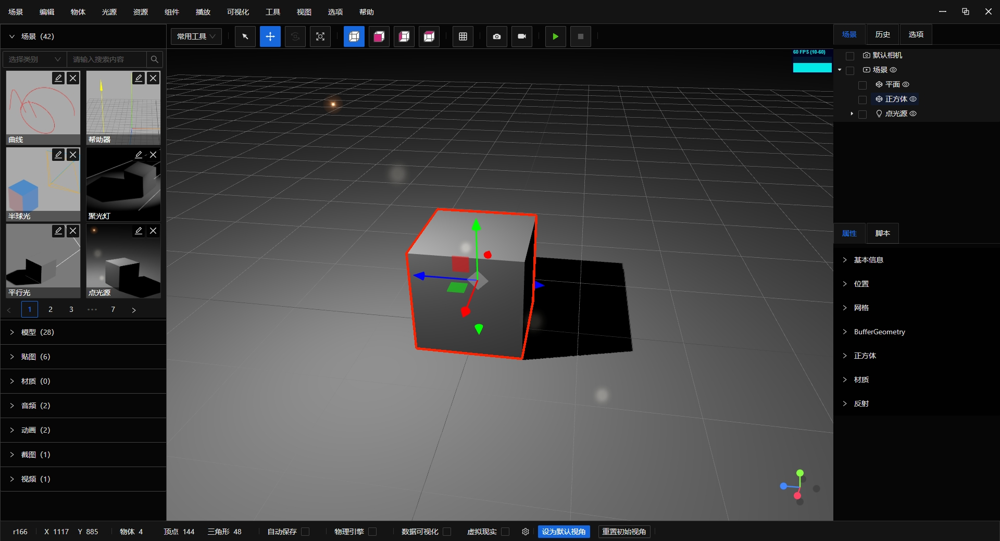

# Shadow Editor Pro

- 版本：0.0.1_alpha20241009
- 简介：基于 Three.js 的三维场景编辑器。
- 端口：3000
- 下载地址：https://pan.baidu.com/s/1W21jWApDhJfqskm_F2XJrQ?pwd=cfz0
- 测试数据包：https://pan.baidu.com/s/15r3dyz0FdXUcsJBj1yI9Sg?pwd=l4tg

## 技术栈

- electron: ^31.1.0
- nest.js：^10.3.9
- typescript: ^5.5.2
- vite：^4.0.0
- vue：^3.4.31
- ant-design-vue：^4.2.3
- three.js：^0.166.0

## 商业授权

如果您有需要，请联系：  
QQ：930372551  
微信号：fwlabr

## 常见问题

跟开源版的主要区别是什么？

1、鼠标控制跟地图差不多，适合大场景；  
2、支持 WebGPU 渲染；  
3、上传模型支持上传文件夹；  
4、代码编辑器改为 monaco-editor；  
5、服务端用 node.js 重写，改为文件存储，不再需要数据库；  
6、新增数据可视化功能。
