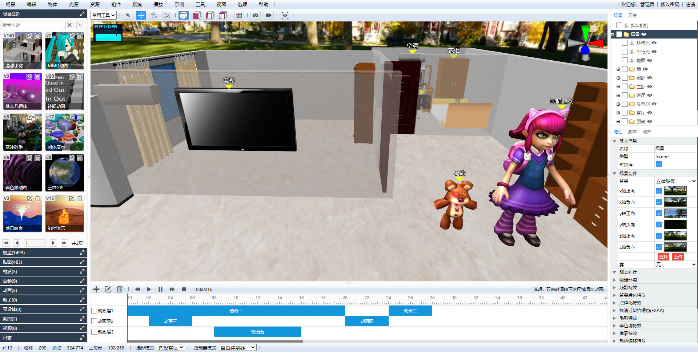
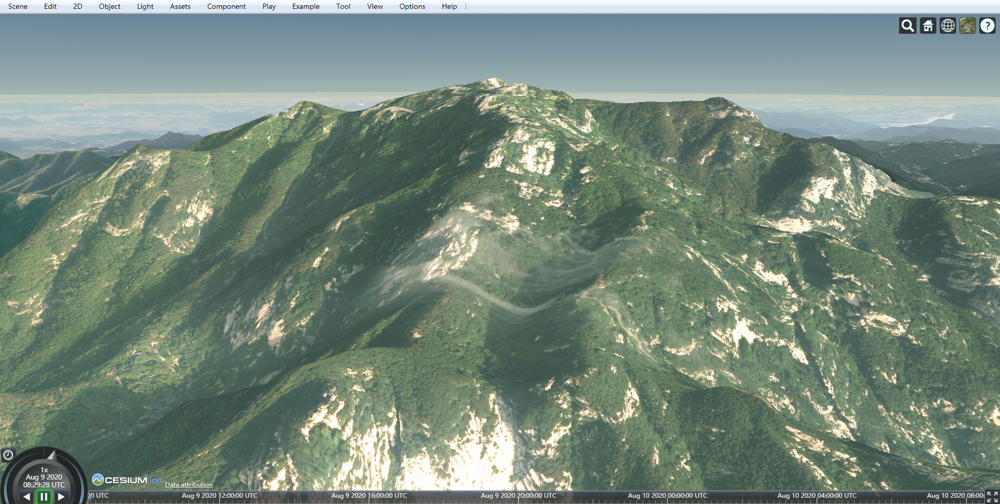

# Shadow Editor

[English](README.md) / 中文 &nbsp;&nbsp; | &nbsp;&nbsp; <a href="https://github.com/tengge1/ShadowEditor/releases/download/v0.5.4/ShadowEditor-win32-x64.zip" title="需要Visual C++ Redistributable for Visual Studio 2015支持">Windows桌面版</a> &nbsp;&nbsp; | &nbsp;&nbsp; <a href="https://github.com/tengge1/ShadowEditor/releases/download/v0.5.4/ShadowEditor-linux-x64.zip">Ubuntu桌面版</a> &nbsp;&nbsp; | &nbsp;&nbsp; [Web演示](http://tengge1.gitee.io/shadoweditor-examples/)  

<a href='https://gitee.com/tengge1/ShadowEditor/stargazers'></img></a>
<a href='https://gitee.com/tengge1/ShadowEditor/members'></img></a>


[](https://gitee.com/tengge1/ShadowEditor/blob/master/LICENSE)
[](https://travis-ci.org/github/tengge1/ShadowEditor)
[](https://twitter.com/tengge11)

* 名称：Shadow Editor
* 版本：v0.5.5 (开发中)
* 简介：基于Three.js、Go语言和MongoDB的跨平台的3D场景编辑器。
* 源码：[GitHub](https://github.com/tengge1/ShadowEditor) [Gitee](https://gitee.com/tengge1/ShadowEditor) | 文档：[Gitee](https://gitee.com/tengge1/ShadowEditor/wikis/pages) | 示例：[GitHub](https://tengge1.github.io/ShadowEditor-examples/) [Gitee](http://tengge1.gitee.io/shadoweditor-examples/) | 视频：[微博](https://weibo.com/tv/v/IjIn9AyvX?fid=1034:4446986821107725) [Bilibili](https://www.bilibili.com/video/av78428475?from=search&seid=9203731141485399611) | 资源：[百度网盘](https://pan.baidu.com/s/1IxJVM6fFLoIAJG-GKHjVTA)
* 技术栈：html、css、javascript、rollup、react.js、webgl、three.js、golang、mongodb、nodejs、electron。
* 如果对您有帮助，请[【捐赠】](https://gitee.com/tengge1/ShadowEditor)支持项目发展。谢谢！





## v0.5.5即将发布

1. 增加WebGL扩展窗口，可以查看浏览器支持的WebGL扩展名称和描述，并可以跳转到MDN。

2. 三维地球。（开发中）

## v0.5.4发布[【更新日志】](https://gitee.com/tengge1/ShadowEditor/wikis/pages?sort_id=2215122&doc_id=188900)

* 发布日期：2020年6月27日
* 更新日志：

1. 使用`Electron`创建桌面应用程序。

Windows桌面版：https://github.com/tengge1/ShadowEditor/releases/download/v0.5.4/ShadowEditor-win32-x64.zip

Ubuntu桌面版：https://github.com/tengge1/ShadowEditor/releases/download/v0.5.4/ShadowEditor-linux-x64.zip

说明：Windows需要`Visual C++ Redistributable for Visual Studio 2015`。你可以从这安装：https://www.microsoft.com/en-us/download/details.aspx?id=48145

2. 使用命令行在Windows上安装和启动ShadowEditor服务。

`.\ShadowEditor install`: 在Windows上安装服务。  
`.\ShadowEditor remove`: 在Windows上移除服务。  
`.\ShadowEditor start`: 在Windows上启动服务。  
`.\ShadowEditor stop`: 在Windows上停止服务。  

你也可以在`Windows服务管理器`中管理这个服务。  

3. 使用`nodejs`重写脚本，现在你可以使用`npm`管理这个项目。  

## 功能特点

1. 跨平台：支持`Windows`、`Linux`和`Mac`；支持桌面版和Web版。
2. 支持多种3D格式：`3ds`, `3mf`, `amf`, `assimp`(anim), `awd`, `babylon`, `binary`, `bvh`(anim), `collada`, `ctm`, `draco` , `fbx`(anim), `gcode`, `gltf`(`gltf`和`glb`, anim), `js`(anim), `kmz`, `lmesh`(anim), `md2`, `mmd`(`pmd`和`pmx`, anim), `nrrd`, `obj`, `pcd`, `pdb`, `ply`, `prwm`, `sea3d`(anim), `stl`, `vrm`, `vrml`, `vtk`, `X`. (anim)表示支持动画。
3. 内置物体：组；平面、正方体、圆、圆柱体、球体、二十面体、圆环面、圆环结、茶壶、车床；不缩放文字、三维文字；线段、CatmullRom曲线、二次贝塞尔曲线、三次贝塞尔曲线、椭圆曲线；点标注；箭头帮助器、轴帮助器；精灵。
4. 内置光源：环境光、平行光、点光源、聚光灯、半球光、矩形光。
5. 内置组件：背景音乐、粒子发射器、天空、火焰、水、烟、布、柏林地形、天空球。
6. 支持材质：线条材质、虚线材质、基本材质、深度材质、法向量材质、兰伯特材质、冯氏材质、点云材质、标准材质、物理材质、精灵材质、着色器材质、原始着色器材质。
7. 编辑`javascript`、`着色器程序`和`json`，具有智能提示。
8. 实时播放器可以播放场景中的动画。
9. 导出`gltf`、`obj`、`ply`、`stl`、`Collada`、`DRACO`模型。
10. 将场景发布成静态资源，可以嵌入`iframe`中。
11. 支持语言：`English`、`中文`、`繁體中文`、`日本語`、`한국어`、`русский`、`Le français`。
12. 场景版本管理：支持历史记录和日志、撤销和重做，自动保存。
13. 权限管理：组织机构、用户、角色、权限、注册、登录、修改密码。
14. 资源管理：场景、模型、贴图、材质、音频、动画、截图、录制视频、字体。

## 需求

1. MongoDB v3.6.8+
2. Chrome 81.0+ 或者 ​​Firefox 75.0+

下面的软件仅在从源码编译时才需要。

1. Golang 1.14.2+
2. NodeJS 14.1+
3. gcc 9.3.0+ （Windows上需要安装`tdm-gcc`、`MinGW-w64`或`MinGW`。请保证`gcc`可以通过命令行访问）
4. git 2.25.1+

**注意** 版本号仅供参考。

## 下载和编译

你可以使用git下载源码。

```bash
git clone https://github.com/tengge1/ShadowEditor.git
```

在国内，由于`github`比较慢，可以使用gitee。

```bash
git clone https://gitee.com/tengge1/ShadowEditor.git
```

### 在Windows和Ubuntu上构建

**Web版：**

1. 如果你在国内， 执行`npm run set-proxy`设置go语言和nodejs代理。
2. 执行`npm install`安装nodejs依赖。
3. 执行`npm run build`构建服务端和Web端。
4. 编辑`build/config.toml`，修改MongoDB的host和port设置。
5. 执行`npm run start`启动服务端。现在你可以访问：`http://localhost:2020`。

**桌面版：**

1. 下载`MongoDB`，解压到`utils/mongodb`文件夹中。
2. 构建Web版。
3. 执行`npm run build-desktop`可以在文件夹`build/desktop`中创建一个桌面版应用。

### 安装为Windows服务

1. 以管理员身份在`build`文件夹中打开`PowerShell`或`cmd`。
2. 运行`.\ShadowEditor install`，将ShadowEditor安装为服务。
3. 运行`.\ShadowEditor start`，启动ShadowEditor服务。
4. 现在你可以访问：`http://localhost:2020`。
5. 你也可以在`Windows服务管理器`中管理这个服务。

### 安装为Ubuntu服务

1. 编辑`./scripts/service_linux/shadoweditor.service`，设置正确的路径。
2. 执行`sudo cp ./scripts/service_linux/shadoweditor.service /etc/systemd/system/`。
3. 执行`sudo systemctl daemon-reload`重新加载服务守护程序。
4. 执行`sudo systemctl start shadoweditor`启动服务。
5. 执行`sudo systemctl enable shadoweditor`设置开机自启动。

## 命令行使用

```
PS E:\github\ShadowEditor\build\> .\ShadowEditor
ShadowEditor is a 3D scene editor based on three.js, golang and mongodb.
This application uses mongodb to store data.

Usage:
  ShadowEditor [command]

Available Commands:
  debug       Debug service on Windows  
  help        Help about any command    
  install     Install service on Windows
  serve       Start server
  start       Start service on Windows
  stop        Stop service on Windows
  version     Print the version number

Flags:
      --config string   config file (default "./config.toml")
  -h, --help            help for ShadowEditor

Use "ShadowEditor [command] --help" for more information about a command.
```

## 开发指南

1. 下载并安装 `NodeJs`, `golang`, `MongoDB` 和 `Visual Studio Code`.
2. 推荐安装以下VSCode扩展， 它们对开发很有用。

```
ESLint, Go, Shader languages support for VS Code, TOML Language Support.
```

npm脚本使用：

```
npm install:            安装nodejs依赖。
npm run build:          构建服务端和web客户端。
npm run build-server:   只构建服务端。(用于开发)
npm run build-web:      只构建web客户端。(用于开发)
npm run build-desktop:  构建桌面版。
npm run dev-web:        文件改编后自动构建web客户端。(用于开发)
npm run start:          启动web服务端。
npm run set-proxy:      设置golang和nodejs代理。(仅在国内使用)
npm run unset-proxy:    取消设置golang和nodejs代理。
npm run install-dev:    安装golang开发工具。
npm run eslint:         检查js文件，自动修复错误。
npm run clean:          删除构建的web版和桌面版。
npm run clear:          删除没用的nodejs包。
```

## 参与贡献

ShadowEditor是一个为用户和开发者而生的项目。在这个项目上，你可以提交代码，尝试你的想法。没有报酬，但是有很多乐趣。提交代码，你需要：

1. Fork 本仓库。
2. 新建 Feat_xxx 分支。
3. 提交代码。
4. 新建 Pull Request。

**注意：** 不要提交大的二进制文件，否则可能会被拒绝。如果需要，你可以把想忽略的文件或目录添加到`.gitignore`文件中。

## 常见问题

1. 上传模型失败。

需要把模型贴图等资源压缩成一个zip包，而且入口文件不能嵌套文件夹。服务端会解压上传的zip包到`./build/public/Upload/Model`文件夹，并在MongoDB `_Mesh`表里添加一条记录。

2. 如何将多个模型组合在一起？

基本几何体都支持多层嵌套。可以添加一个`组`（在几何体菜单中），然后在场景树状图上，将多个模型拖动到`组`上。

3. 如何开启权限系统？

编辑`config.toml`文件，将`authority.enabled`设置为`true`。默认管理员用户名是`admin`，密码是`123456`。

4. 前端报`asm.js 已被禁用，因为脚本调试程序已连接。请断开调试程序的连接，以启用 asm.js。`的错误。

**完整错误**：asm.js 已被禁用，因为脚本调试程序已连接。请断开调试程序的连接，以启用 asm.js。 ammo.js (1,1) SCRIPT1028: SCRIPT1028: Expected identifier, string or number ShadowEditor.js (3948,8) SCRIPT5009: 'Shadow' is not defined。  
**解决方法**：腾讯浏览器不支持使用`Emscripten`编译的`ammo.js`（WebAssembly），建议换成谷歌浏览器或火狐浏览器。

5. 怎么从C#版本升级到golang版本？

数据结构和客户端都没变，只需要把文件夹`./ShadowEditor.Web/Upload/`复制到`build/public/Upload/`即可。

## 开源项目

感谢以下开源项目。

<details>
  <summary>展开查看详情</summary>

https://github.com/golang/go  
https://github.com/BurntSushi/toml  
https://github.com/dgrijalva/jwt-go  
https://github.com/dimfeld/httptreemux  
https://github.com/inconshreveable/mousetrap  
https://github.com/json-iterator/go  
https://github.com/mozillazg/go-pinyin  
https://github.com/otiai10/copy  
https://github.com/sirupsen/logrus  
https://github.com/spf13/cobra  
https://github.com/spf13/viper  
https://github.com/urfave/negroni  
https://go.mongodb.org/mongo-driver  
  
https://github.com/facebook/react  
https://github.com/mrdoob/three.js  
https://github.com/rollup/rollup  
https://github.com/babel/babel  
https://github.com/eslint/eslint  
https://github.com/rollup/rollup-plugin-babel  
https://github.com/rollup/rollup-plugin-commonjs  
https://github.com/rollup/rollup-plugin-json  
https://github.com/rollup/rollup-plugin-node-resolve  
https://github.com/egoist/rollup-plugin-postcss  
https://github.com/rollup/rollup-plugin-replace  
https://github.com/mjeanroy/rollup-plugin-strip-banner  
  
https://github.com/tweenjs/tween.js  
https://github.com/JedWatson/classnames  
https://github.com/d3/d3-dispatch  
https://github.com/i18next/i18next  
https://github.com/js-cookie/js-cookie  
https://github.com/facebook/prop-types  
https://github.com/codemirror/CodeMirror  
https://github.com/jquery/esprima  
https://github.com/tschw/glslprep.js  
https://github.com/zaach/jsonlint  
https://github.com/acornjs/acorn  
https://github.com/kripken/ammo.js  
https://github.com/dataarts/dat.gui  
https://github.com/toji/gl-matrix  
https://github.com/squarefeet/ShaderParticleEngine  
https://github.com/mrdoob/stats.js  
https://github.com/mrdoob/texgen.js  
https://github.com/yomotsu/VolumetricFire  

https://github.com/NASAWorldWind/WebWorldWind  

</details>