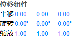

# ShadowEditor.UI

ShadowEditor.UI将常用的UI控件封装为类，可以像ExtJs那样通过javascript动态生成页面。这对于功能特别多、逻辑特别复杂的页面特别有用，
非常适合做编辑器开发，用于为[ShadowEditor](https://github.com/tengge1/ShadowEditor)提供完善的UI框架支持。

**ShadowEditor.UI不保证兼容除最新版`Chrome`以外的其他浏览器。**

使用方法：

```javascript
var hello = Shadow.UI.create({
    xtype: 'html',
    html: 'Hello, world!'
});

hello.render();
```

其中，类型`html`是框架提供的Html控件的xtype，属性`html`是Html控件的一个属性，它的值会被原生输出到页面上。

也可以使用`UI`代替`Shadow.UI`，这是因为框架中默认把`UI`绑定到`window`对象上，方便使用。

## 依赖项

无。

## 类库

|       类名         |       xtype       |        说明          |       类名         |      xtype         |        说明           |
|-------------------|-------------------|----------------------|--------------------|--------------------|-----------------------|
|   UI              |    无              |   框架核心。          |   Control          |   control          |   所有控件基类。       |
|   Boolean         |    boolean         |   复选框带说明。      |   Break            |   br               |   换行。              |
|   Button          |    button          |   按钮。             |   Checkbox         |   checkbox         |   复选框。             |
|   CloseButton     |    closebutton     |   关闭按钮。          |   Color            |   color            |   颜色选择。          |
|   Container       |    container       |   容器。             |    Div             |    div             |   div元素。           |
|   HorizontalRule  |    hr              |   横线。             |    Html            |    html            |   原生html。          |
|   IconButton      |    iconbutton      |   图标按钮。         |    Input            |   input           |   文本输入框。         |
|   Integer         |    int             |   整数输入。         |    Label           |    label           |   标签。              |
|   Modal           |    modal           |   模态框。           |    Number           |    number         |   浮点数输入。         |
|   Row             |    row             |   一行。             |    Select           |    select         |   下拉列表。          |
|   Span            |    span            |   span元素。         |    Text             |    text           |   文本标签。          |
|   TextArea        |    textarea        |   文本域。           |    Texture          |    texture         |   选择纹理。          |
|   Window          |    window          |   窗口。             |    Image            |    image           |   图片。             |
|   ImageList       |    imagelist       |   图片列表。         |    MessageBox       |     msg            |   消息框。            |
|   Table           |    table           |   表格。             |    TableHead       |      thead          |   thead元素。        |
|   TableBody       |    tbody           |   tbody元素。        |    TableRow        |      tr             |   tr元素。           |
|   TableData       |    td              |   td元素。           |    Alert           |      alert          |   提示框。           |
|   Confirm         |    confirm         |   询问框。           |    Prompt           |     prompt         |   弹出输入框。        |
|   SearchField     |    searchfield     |   查询框。           |    ToolbarFiller    |     toolbarfiller  |   工具栏填充。        |
|   Canvas          |    canvas          |   画布。             |    Timeline         |     timeline       |   时间轴。           |
|   LinkButton      |    linkbutton      |   链接按钮。         |                     |                    |                      |

## 原理

* ShadowEditor.UI并不是通过拼接字符串的方式生成页面，而是通过两个函数`document.createElement`和`[HTMLElement].appendChild`来动态渲染页面。
* 当调用`[Control].render`函数时，它首先渲染最外层元素，然后最外层元素根据`children`属性列表中的`xtype`，创建相对应的类，来一层一层向内渲染。

## 核心函数

`UI`：用于xtype注册、控件的创建和管理，并提供所有控件类型引用和一些便捷函数。

`UI.addXType(name, cls)`：将控件类型注册为xtype，例如`UI.addXType('html', Html)`。

`UI.removeXType(name)`：移除控件xtype。

`UI.getXType(name)`：通过xtype获取控件类型

`UI.add(id, obj, scope = "global");`：将控件实例交给ShadowEditor.UI管理，global是命名空间。

`UI.remove(id, scope = 'global');`：移除一个控件实例。

`UI.get(id, scope = 'global')`：通过id和命名空间获取一个控件实例。

`UI.create(config)`：通过json对象创建页面，json中的元素可以是带xtype的对象或控件实例。xtype必须事先注册。

请阅读[UI.js](src/UI.js)的源码来了解每个函数使用方法，非常简单。

## 示例

以下代码节选自[TransformComponent.js](../ShadowEditor.Web/src/component/TransformComponent.js)，有改动。

```javascript
var control = UI.create({
    xtype: 'div',
    id: 'transformPanel',
    parent: document.body,
    cls: 'Panel',
    children: [{
        xtype: 'row',
        children: [{
            xtype: 'row',
            children: [{
                xtype: 'label',
                style: {
                    color: '#555',
                    fontWeight: 'bold'
                },
                text: '位移组件'
            }]
        }, {
            xtype: 'row',
            children: [{
                xtype: 'label',
                text: '平移'
            }, {
                xtype: 'number',
                id: 'objectPositionX',
                style: {
                    width: '40px'
                }
            }, {
                xtype: 'number',
                id: 'objectPositionY',
                style: {
                    width: '40px'
                }
            }, {
                xtype: 'number',
                id: 'objectPositionZ',
                style: {
                    width: '40px'
                }
            }]
        }, {
            xtype: 'row',
            children: [{
                xtype: 'label',
                text: '旋转'
            }, {
                xtype: 'number',
                id: 'objectRotationX',
                step: 10,
                unit: '°',
                style: {
                    width: '40px'
                }
            }, {
                xtype: 'number',
                id: 'objectRotationY',
                step: 10,
                unit: '°',
                style: {
                    width: '40px'
                }
            }, {
                xtype: 'number',
                id: 'objectRotationZ',
                step: 10,
                unit: '°',
                style: {
                    width: '40px'
                }
            }]
        }, {
            xtype: 'row',
            children: [{
                xtype: 'label',
                text: '缩放'
            }, {
                xtype: 'number',
                id: 'objectScaleX',
                value: 1,
                range: [0.01, Infinity],
                style: {
                    width: '40px'
                },
            }, {
                xtype: 'number',
                id: 'objectScaleY',
                value: 1,
                range: [0.01, Infinity],
                style: {
                    width: '40px'
                }
            }, {
                xtype: 'number',
                id: 'objectScaleZ',
                value: 1,
                range: [0.01, Infinity],
                style: {
                    width: '40px'
                }
            }]
        }]
    }]
});

control.render();
```

效果图：



## 注意事项

* 目前，ShadowEditor.UI提供控件类型太少，每个控件的属性和方法太少，远远无法满足需要。建议直接使用源码，遇到缺少的控件、属性、方法自行添加。
* ShadowEditor.UI采用[ECMAScript6](http://es6.ruanyifeng.com/)的一些语法，不兼容不支持[ECMAScript6](http://es6.ruanyifeng.com/)的浏览器，推荐使用最新版谷歌浏览器开发使用。

## 特别感谢

* [ExtJs](https://www.sencha.com/products/extjs/)提供UI框架架构思路。
* [three.js](https://threejs.org/)编辑器提供最初的UI样式。
* [bootstrap-es6](https://github.com/tengge1/bootstrap-es6)提供练手机会。