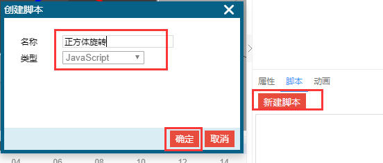
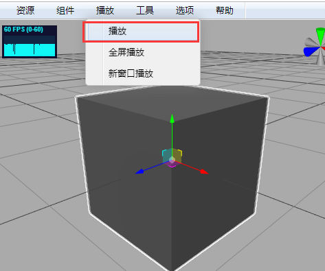
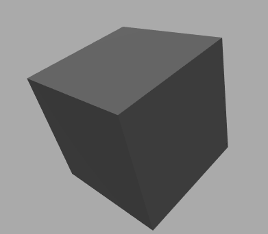

# 脚本

我们通过`正方体旋转`的例子，说明脚本的用法。

* 在场景中添加一个名称为`正方体`的正方体。


* 在侧边栏脚本面板点击`新建脚本`按钮，添加一个叫`正方体旋转`的脚本。



* 修改脚本为以下代码，关闭脚本编辑器会自动保存。


```javascript
var box = scene.getObjectByName('正方体');

// 程序运行过程中，每帧都要执行
function update(clock, deltaTime) {
	box.rotation.x += 0.1;
}
```

* 点击播放菜单下的播放。正方体旋转起来了。



