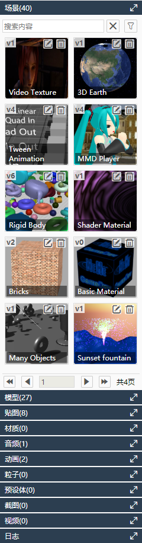
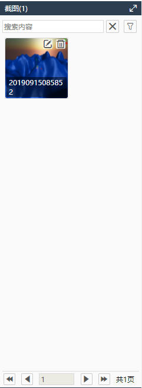
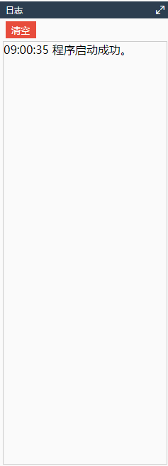

# 资源管理器

由场景、模型、贴图、材质、音频、动画、粒子、预设体、截图、视频、日志面板组成。

## 场景

场景列表，载入场景，编辑场景信息、删除场景。

## 模型

模型列表，添加模型，编辑模型信息，删除模型。

## 贴图

贴图列表，添加贴图，编辑贴图信息，删除贴图。

## 材质

材质列表，设置材质，编辑材质信息，删除材质。

## 音频

音频列表，添加音频，编辑音频信息，删除音频。

## 动画

动画列表，添加动画，编辑动画信息，删除动画。

## 粒子（待开发）

## 预设体（待开发）

## 截图

截图列表，截图查看，编辑截图信息，删除截图。

## 视频

视频列表，视频查看，编辑视频信息，删除视频。

## 日志

查看日志，清空日志记录。

