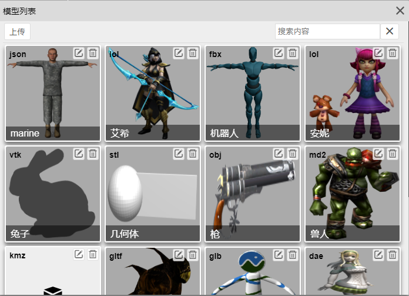

# 菜单栏

## 场景

**新建**

新建场景，当前场景会被清空。

**载入**

打开场景窗口，并从服务端加载场景列表，提供编辑、删除场景功能。可以在编辑窗口修改场景名称和缩略图。

**保存**

保存当前场景。如果新建场景，保存时会提示输入场景名称保存为新场景。如果是从服务端载入场景，则直接保存到原场景上。如果需要保存为新场景，则需要使用另存为功能。

**另存为**

将场景另存为一个新场景。

**发布（开发中）**

将当前场景发布到示例文件夹。

## 编辑

**撤销**

撤销上一步操作。

**重做**

重做上一步操作。

**清空历史记录**

清空侧边栏历史面板所有历史记录，无法再进行撤销、重做操作。

**复制**

将当前物体复制为一个新物体。

**删除**

删除当前选中物体。

## 几何体

**组**

添加一个容器，可以在场景层次图将其他物体拖动到该物体上。

**平板**

添加一个平板。

**正方体**

添加一个正方体。

**圆**

添加一个圆。

**圆柱体**

添加一个圆柱体。

**球体**

添加一个球体。

**二十面体**

添加一个二十面体

**轮胎**

添加一个轮胎

**纽结**

添加一个纽结。

**茶壶**

添加一个茶壶。

**酒杯**

添加一个酒杯。

**精灵**

添加一个精灵，该物体总是朝向照相机。

**文本**

在场景中添加文本，支持中文。

## 光源

**环境光**

添加环境光。

**平行光**

添加平行光。

**点光源**

添加点光源。该光源自带一个表示发光体的小球，默认开启光晕。

**聚光灯**

添加聚光灯。

**半球光**

添加半球光。该光源自带一个表示天空和地面的包围盒。

**矩形光**

添加矩形光。该光源自带一个矩形物体表示发光体。

## 资源

**模型管理**

打开模型列表窗口，点击添加模型。支持编辑、删除。可以修改模型名称和上传缩略图。

**纹理管理**

打开纹理列表窗口，可以在材质组件中选择纹理。支持编辑、删除。可以修改纹理名称和上传缩略图。

