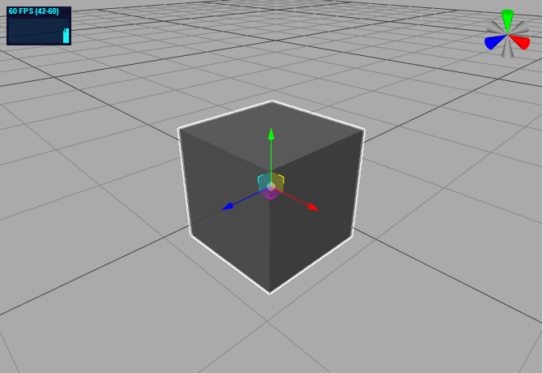
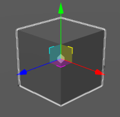
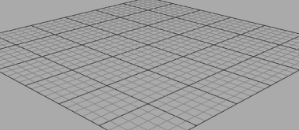

# 场景编辑区

场景编辑区可以使用鼠标可视化编辑场景。

## 场景操作

鼠标左键旋转场景，鼠标右键平移场景，鼠标滚动缩放场景。

## 选中物体

点击物体可以选中物体。

## 平移物体

点击平移工具。选中物体后，使用鼠标拖动红、绿、蓝三个箭头，可以修改物体位置。

## 旋转物体

点击旋转工具。选中物体后，使用鼠标拖动红、绿、蓝三条曲线，可以旋转物体。

## 缩放物体

点击旋转工具。选中物体后，使用鼠标拖动红、绿、蓝三条线段，可以对物体进行缩放。

## 定位物体

双击物体，可以迅速切换到该物体视角。

## 删除物体

选中物体后，按`Del`键可以删除物体。

## 网格帮助器

场景中默认有网格，可以在状态栏开启关闭。

## 性能监视器

场景左上角是性能监视器，可以在状态栏开启关闭。点击可以切换帧数、一帧渲染时间、占用内存。

## 视角帮助器

场景右上角是视角帮助器，可以指示场景方向。红色是X轴正向，绿色是Y轴正向，蓝色是Z轴正向。可以在状态栏开启关闭。

