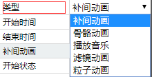
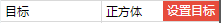
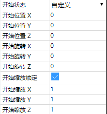
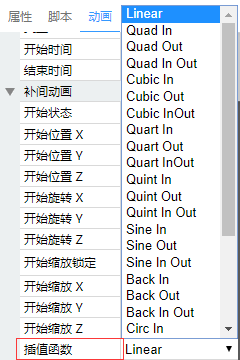
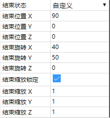

# 动画面板

配合动画编辑器可以编辑补间动画。 

## 动画名称

点击名称属性，可以设置动画名称。

## 动画类型

点击动画类型下拉框，可以选择动画类型，目前只支持补间动画。

## 动画目标

选择场景中的物体，点击设置目标按钮，可以将选择的物体设为动画目标。

## 开始时间

设置开始时间，单位是秒。

## 结束时间

设置结束时间，单位是秒。

## 开始状态

设置物体开始状态。

## 插值函数

设置补间动画用的插值函数。

## 结束状态

设置物体结束状态。

