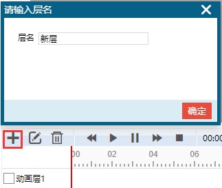
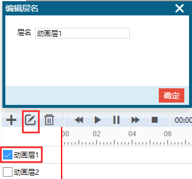
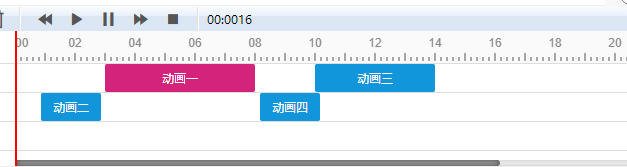

# 动画编辑器

双击添加动画，配合侧边栏动画面板可以创建补间动画。

## 动画层管理

**添加动画层*

点击加号添加动画层，输入层名，保存。

**编辑动画层**

选择动画层，点击编辑按钮。

**删除动画层**

选择动画层，点击删除按钮。

## 动画管理

在时间轴下方双击鼠标添加动画。

使用鼠标拖动，可以改变动画位置。

点击选择动画，在侧边栏可以设置动画属性。红色表示当前选中动画。