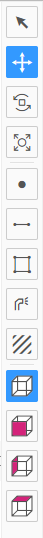
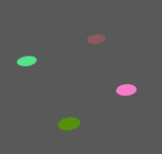
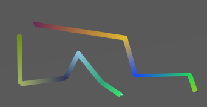
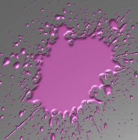

# 工具栏

由选择、平移、旋转、缩放、画点、画线、画面、贴花、透视图、正视图、侧视图、顶视图几个工具组成。

## 选择工具

点击场景选中物体。

## 平移工具

点击场景选中物体，拖动箭头可以改变物体的位置。

## 旋转工具

点击场景选中物体，拖动箭头可以改变物体的旋转。

## 缩放工具

点击场景选中物体，拖动箭头可以改变物体的缩放。

## 画点

在平面上画一个点。

## 画线

在平面上画一条线。

## 画面

在平面上画一个面。

## 贴画

在平面上画一个贴花。

## 透视图

显示透视图场景。

## 正视图

显示正视图场景。

## 侧视图

显示侧视图场景。

## 顶视图

显示顶视图场景。