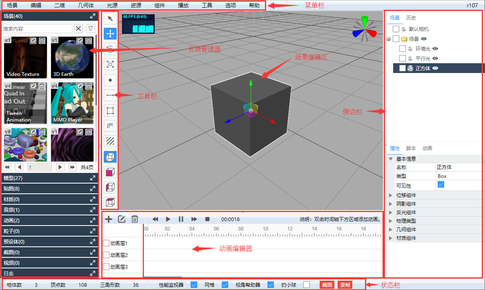

# 用户界面

Shadow Editor的用户界面包括菜单栏、资源管理器、工具栏、场景编辑区、动画编辑器、侧边栏、状态栏、播放器、脚本编辑器等。

## 菜单栏

由场景、编辑、二维、几何体、光源、资源、组件、播放、工具、选项、帮助几个菜单组成。

菜单栏最右侧是three.js的版本。

## 资源管理器

由场景、模型、贴图、材质、音频、动画、粒子、预设体、截图、视频、日志等几个面板组成，用于管理所有资源。

## 工具栏

由选择、平移、旋转、缩放、画点、画线、画面、贴花、透视图、正视图、侧视图、顶视图等几个工具组成。

## 场景编辑区

可以使用鼠标编辑场景中的物体，进行平移、旋转、缩放等操作。左键旋转场景，右键平移场景、滚轮缩放场景。

选中物体，按`Del`键可以删除物体。

## 动画编辑器

双击添加动画，配合侧边栏动画面板可以创建补间动画。

## 侧边栏

由场景面板、历史面板、属性面板、脚本面板、动画面板组成。

**场景面板**：编辑场景层级结构，单击选择，双击定位。  
**历史面板**：查看场景编辑历史，可以快速回退到某个历史状态。  
**属性面板**：可视化编辑场景元素的属性。  
**脚本面板**：可以创建脚本，使用脚本编辑器编辑脚本。  
**动画面板**：配合动画编辑器可以编辑补间动画。  

## 状态栏

1. 提供场景中所有物体的物体数、顶点数、三角形数。
2. 启用禁用性能监视器、网格、视角帮助器。
3. 截图工具和录制视频工具。

## 播放器

使用播放器播放场景中的所有动画，运行所有脚本。

## 脚本编辑器

新建和编辑Javascript、GLSL、ProgramInfo时，会出现脚本编辑器，带语法高亮和智能提示，非常方便。

点击叉号关闭窗口时，可以自动保存脚本。

